# Wye

**Product definition and long-term memory for coding agents.**

Wye keeps what a product is *supposed to do* in Markdown in Git: its requirements, rules, decisions, constraints,
architecture and context. Coding agents read that definition before they build. What they learn and decide while
building comes back as proposed knowledge for a person to review.

So instead of every agent session starting by reconstructing intent from code, tickets and chat history, the product
develops a memory.


```bash
npm install -g @emlab/wye
wye setup              # your products go in ~/.wye/data; the Claude Code skills into ~/.claude/skills
wye app                # the app at http://localhost:3456
```

Needs Node.js 20.9+ and [Claude Code](https://claude.com/claude-code) or [Codex](https://github.com/openai/codex)
installed: Wye runs its agents through them. Local-first, no accounts, Apache-2.0.
[Getting started](#getting-started) has the details.

---

## Why Wye?

Coding is becoming easier to delegate to agents. Describing **what should be built, why, and under which
constraints** is not.

The knowledge needed to make a product change is usually scattered across the code, Jira or Linear, Notion or
Confluence, Slack, architecture documents, previous agent conversations, and people's heads. A coding agent sees only
part of it.

Give an agent a request like:

> Change the refund window from 30 days to 14 days.

and several questions appear at once:

- Where is the current 30-day rule defined?
- Which customer promises depend on it?
- Does another requirement contradict the change?
- Which services, tests and UI flows are affected?
- Was the old rule a deliberate product decision, or an implementation detail?
- If the agent discovers something important while building, where does that knowledge go?
- Will the next agent know what happened?

The usual workflow is roughly:

```text
prompt → agent reads some code → agent reconstructs context → agent makes assumptions → code
```

Wye explores a different one:

```text
product definition → Prompt Request → impact + contradictions → human decision
    → agent → review → approved memory → next change
```

The central idea:

> **Humans own the product definition. Agents derive changes from it.**

## What is Wye?

Wye is an editor and runtime for a product's **definition**: its goals, users, requirements, rules, constraints,
decisions, entities, architecture, tests, questions, commitments and tasks, and the relationships between them.

They are stored as ordinary Markdown files in Git. Wye reads the important blocks in those files as nodes in a graph,
which gives the same knowledge two forms:

```text
Markdown   for people to read and edit
   ⇅
Graph      for software and agents to reason over
```

The Markdown is canonical and the graph is derived from it. There is no separate knowledge database you have to trust
as the source of truth.

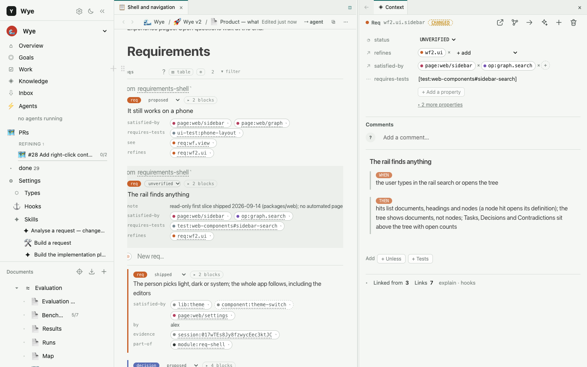
*A document of requirements. Every block is a node; opened in the column, its links are editable.*

## The idea in one example

*An illustration.* Say the product definition contains:

```markdown
req:refund.window Customers may request a refund within 30 days of purchase.

decision:refund.window Refunds use a 30-day window because enterprise contracts promise 30 days.

test:refund.window Refund requests on days 1–30 are accepted; requests after day 30 are rejected.
```

Now someone asks: *reduce the refund window to 14 days.*

In a normal coding-agent workflow, the agent searches the repository, finds the constant and changes it. But the
code is only part of the story.

Wye treats the request as a change to the **product definition** first. The proposed 14-day rule contradicts
`decision:refund.window`, because enterprise contracts still promise 30 days, and the graph shows the test and the
other parts of the product linked to it. Before any code is written, a person has a decision to make:

```text
A  Keep enterprise customers at 30 days and move everyone else to 14.
B  Change the contracts and move everyone to 14.
C  Don't make the change.
```

Once the intended behaviour is approved, the coding agent gets the requirements, constraints and decisions in force,
and builds the change. If it finds during the build that enterprise refunds go through a separate service, that does
not have to disappear into the transcript. The agent proposes it:

```markdown
fact:refund.enterprise-service Enterprise refunds are processed by component:enterprise-refunds.
```

A person reviews it. Once approved, it is part of the product's memory, and the next change starts with more
knowledge than this one did. That accumulation is the point.

## The Wye loop

### 1. Define

Describe the product in documents. Most of it can be ordinary prose, but the important pieces get stable ids:

```markdown
goal:checkout.fast Checkout should feel instantaneous.

req:sale.close When the final kitchen item is completed, the order becomes Closed.

rule:payments.capture Payment must be captured before an order can be completed.

decision:payments.provider Use Stripe for online card processing.
```

These are still readable Markdown. Because they have ids, Wye can connect them. You can also start from code:
`wye init` reads a repository into a first, shallow definition, and `wye deepen` sends an agent to describe each module
in a person's words.

### 2. Request

A change starts as a **Prompt Request**. In Wye, PR does not mean pull request.

A Prompt Request describes what you want to change before an agent changes the code: what is asked and why, what
behaviour changes, what stays the same, which questions are open, and what the change may reach. A *librarian* agent
refines it with you. It writes a summary of what will be built, asks questions, and proposes the blocks the request
needs. The librarian never writes code: its job is to understand the change.

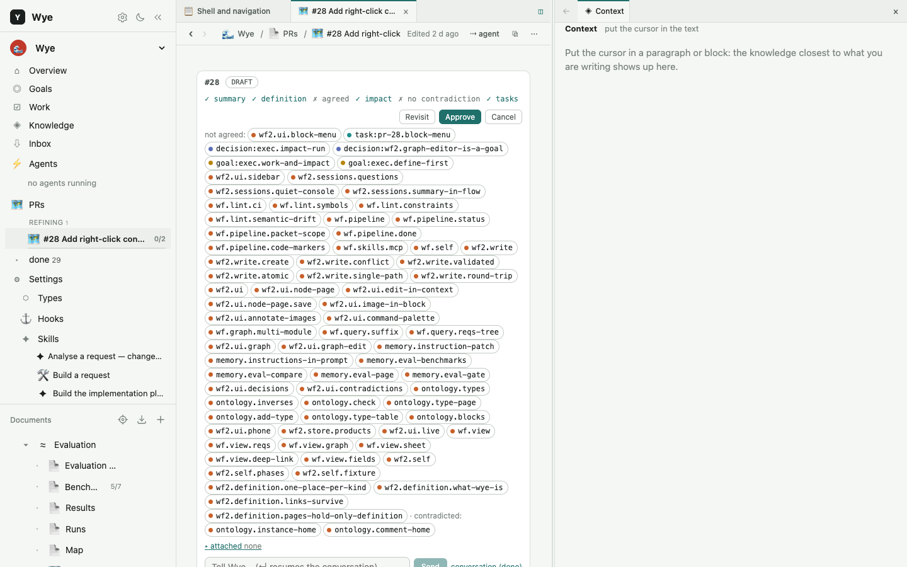
*A Prompt Request: its readiness checks, Approve, and every node the change may touch.*

### 3. Understand the impact

Wye knows how requirements, decisions, components, tests and pages relate, so it can compute what a change may reach:

```text
req:refund.window
  ├─ verified-by   test:refund.window
  ├─ governed-by   decision:refund.window
  ├─ satisfied-by  component:refund-api
  └─ satisfied-by  page:account.refunds
```

This happens **before** implementation. The goal is not to predict every changed line of code. It is to put the
product knowledge around a change in front of people and agents, so nobody works from an isolated prompt.

### 4. Resolve contradictions

Products change, and so does what they know. A new requirement may agree with an existing one, refine it, duplicate
it, supersede it, or contradict it.

Wye makes contradictions visible rather than letting an agent settle them quietly:

```text
Existing:  Refunds are available for 30 days.
Proposed:  Refunds are available for 14 days.
```

That is not necessarily an error; it may be a legitimate product change. But someone, ideally a person, should decide
which statement is now in force and what happens to the old one.

When something is written, Wye's judge compares it with its neighbours in the graph and classifies each pair as
`duplicate`, `refines`, `consistent` or `contradicts`. For a contradiction it also names the kind: a fact against a
fact, a later state of the same thing, or a conflict only under some condition. Each verdict records the model and
prompt that produced it, so it can be replayed and evaluated. A contradiction is itself a node in the graph, and
approving a block with an open one means choosing: supersede the other side, refine this one, or dismiss it with a
reason.

### 5. Approve

Agents can propose changes to the definition. They cannot make those proposals true.

> **Agents propose. Humans approve.**

Approval matters because product knowledge is not generated text. Once something is part of the definition, future
agents will make decisions based on it. Changing a product's memory is a meaningful act.

### 6. Build

Once a request is defined and approved, Wye hands it to a coding agent, Claude Code or Codex. The agent's first
message carries the constraints in force: a bounded description of the world around the change, so it doesn't have
to infer the whole product from the repository. Requests whose scopes don't overlap can be built in parallel.

The code stays in your normal repository. Wye is not trying to replace Git, your language or your coding agent. It
tries to improve what flows into the agent and what comes back out.

### 7. Review

A build produces more than code. On the way, an agent may find an undocumented architectural constraint, a dependency
nobody recorded, a new domain rule, the reason an old implementation exists, an open question, or a decision it had
to make to finish the work.

Those come back to Wye as proposed knowledge and wait in the **Inbox**, where a person approves, edits or rejects
them.

### 8. Remember

Approved knowledge becomes the context for future work:

```text
          ┌────────────────────┐
          │ product definition │◄─────────────────┐
          └─────────┬──────────┘                  │
                    ▼                             │
               new request                        │
                    ▼                             │
            impact / decisions                    │
                    ▼                             │
              human approval                      │
                    ▼                             │
                  agent                           │
                    ▼                             │
             discoveries + code                   │
                    ▼                             │
               human review                       │
                    ▼                             │
              approved memory ────────────────────┘
```

The definition grows richer as the product evolves.

## Product memory, not chat memory

Many coding-agent products now have some notion of "memory". Wye means something more specific by it. Memory is not
*here are some old conversations*. It is structured knowledge whose relationship to the current product can be
inspected:

```yaml
- id: decision:orders.close-v2
  status: approved
  supersedes: decision:orders.close-v1
```

The old decision doesn't disappear; it stays in the history, marked as superseded. What matters is knowing which
statement is in force now. Every node can say since when and until when it holds, so a product keeps both *what we
believed then* and *what is true now*, without flattening them into one timeless context dump.

The context an agent gets is computed, not recalled. A request's first message carries every rule, constraint,
approved decision and goal within two hops of what it touches, plus the open questions on them. That is a walk over
the graph, complete by construction. Search only finds where to start the walk; it is never the authority on what
governs.

## Everything important can have an id

The smallest useful unit in Wye is a block with an id:

```markdown
req:sale.close When the final kitchen item is completed, the order is marked Closed.

decision:memory.bitemporal Product knowledge keeps its history rather than overwriting old states.

entity:order One customer's active purchase.
```

An id lets other knowledge refer to it, and those references become edges in the graph:

```markdown
test:sale.close verifies req:sale.close.
component:order-service satisfies req:sale.close.
rule:close-on-complete governs req:sale.close.
```

The words before an id name the verb (*verifies*, *satisfies*, *governs*, *depends on*, *part of*); the parser fills
in the inverse on the other side.

## Markdown is the database

Wye keeps the canonical form deliberately boring: **text files in Git.**

```markdown
req:sale.close When a sale is completed and all [kitchen items](entity:kitchen-item) are done, et:order is marked Closed. #proposed
  - when:sale.close the final kitchen item is completed
  - then:sale.close the order is marked Closed
```

Wye parses the documents into nodes and relationships. The graph can then answer questions like:

- What implements this requirement? Which tests verify it?
- Which decisions govern it, and what superseded them?
- What would this change affect? Which constraints apply?
- Which open questions concern this area?

The files stay usable without Wye: read them on GitHub, edit them in any editor, diff them, branch them, review their
history.

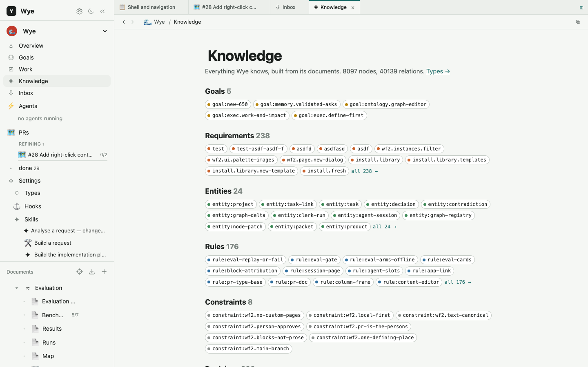
*Knowledge: everything the product knows, by kind.*

## The type system is open

Wye has base types such as `req:`, `rule:`, `decision:`, `constraint:`, `goal:`, `entity:`, `question:`, `task:`,
`page:` and `test:`. It doesn't prescribe one universal ontology, though: a product declares its own vocabulary.

| a product for | might add |
|---|---|
| software it builds | `component:`, `fact:`, `lib:` |
| logistics | `vehicle:`, `route:`, `depot:`, `driver:` |
| evaluation | `eval:`, `dataset:`, `benchmark:`, `run:` |
| hospitality | `restaurant:`, `menu:`, `dish:`, `table:` |

Declare the type as a card in any document and its instances join the same graph. See
[docs/type-system.md](docs/type-system.md) for the full model.

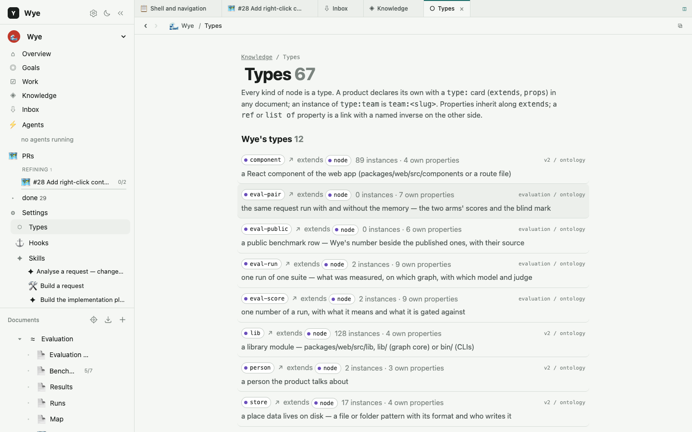
*Types: each kind with what it extends, its properties and how many instances it has.*

## The Constitution

Some constraints matter to every change, even when no code can enforce them:

```text
Never expose one tenant's data to another tenant.
Text files in Git are canonical.
All externally visible behaviour must have a requirement.
Agents may propose knowledge but may not approve it.
```

Wye calls these product-level constraints the **Constitution**. The approved ones go verbatim into every agent's
system prompt, so they are hard to lose between sessions.

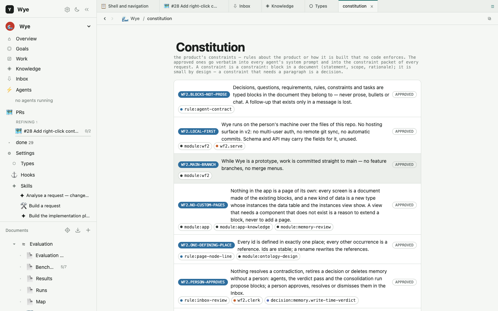

## Ask

**Ask** (⌘F) answers questions about the product, searching across its knowledge, documents, code, graph and agent
sessions:

```text
Why do we use a 30-day refund window?
What happens when the final kitchen item is completed?
Which requirements depend on component:order-service?
```

A question gets two answers at once: a fast one in a few seconds, and a deeper one from an agent that searches,
follows the graph and reads the code while you watch the sources it opens. Answers cite their sources, so you can
check them rather than trust unsupported model output. The index is local; nothing leaves the machine except the
answering model call.

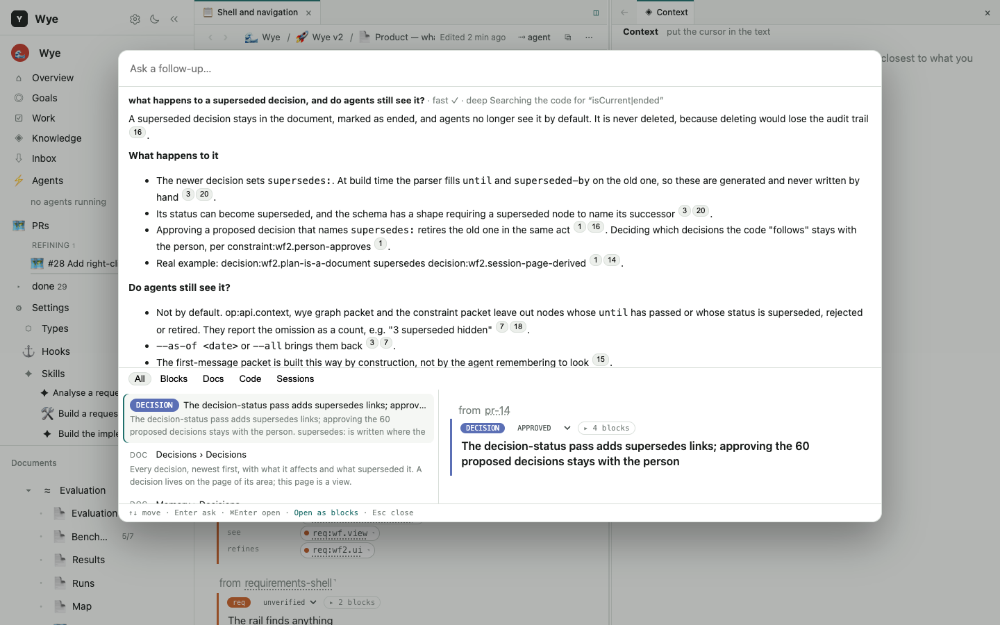
*Ask: a cited answer, the sources the deeper search found, and the passages behind it.*

## Remember

Not all useful knowledge starts as a formal requirement. Sometimes someone pastes:

```text
Talked to Acme today. Their finance team needs invoices to keep the original PO number
even when the invoice is regenerated. They won't roll out to Germany until this works.
```

**Remember** (⌘M) turns that into proposed knowledge. A librarian agent splits it into single statements, finds what
each one is about, and proposes where it belongs:

```text
requirement    regenerated invoices keep the original PO number
customer fact  Acme needs this for its finance workflow
commitment     the German rollout depends on the requirement
```

A detail goes onto the block that already holds it, and a newer state supersedes the old one. What the librarian can't
place, it asks you about. Everything stays proposed until reviewed. The goal is not to store every conversation
forever; it is to pull durable knowledge out of passing communication.

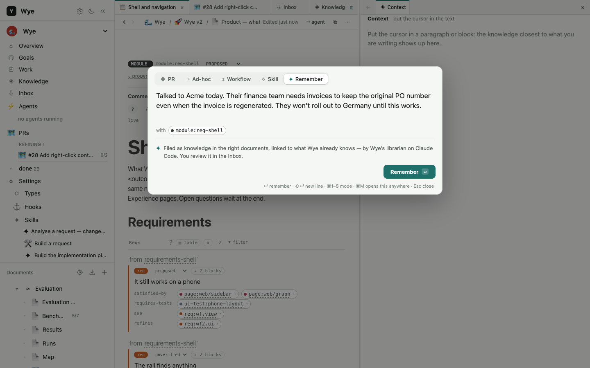

## The Inbox

Everything newly proposed waits in one place: new requirements and decisions, changed facts, edits to existing blocks
(shown as diffs), agent discoveries, open questions.

The Inbox is a review surface, not another source of truth: approving a block changes its status in the Markdown
document it lives in.

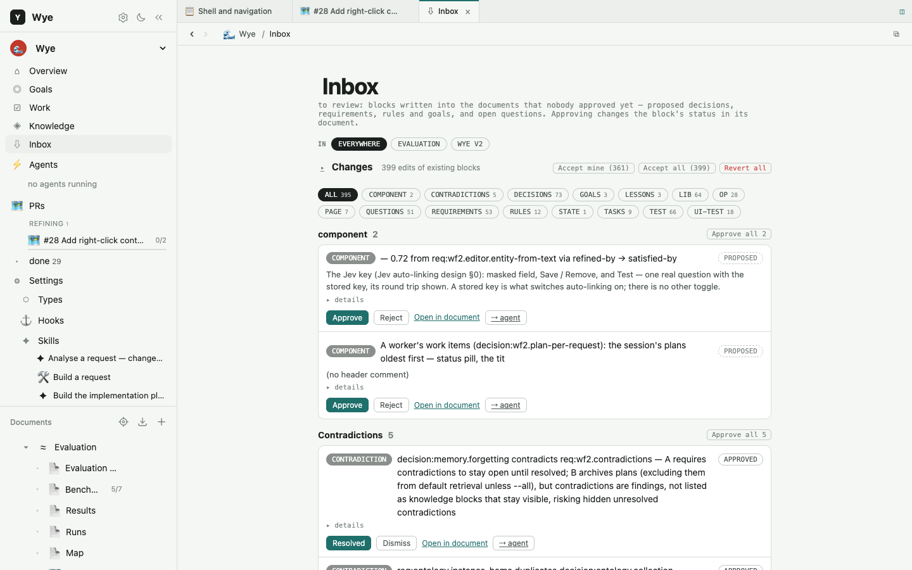

## Tables and queries

Because the definition is a graph, it can be queried. Every table in Wye runs SQL over an in-memory DuckDB copy of
the graph, so views like these are queries over the same definition rather than lists someone keeps by hand:

```text
every requirement without a test
every open question that affects checkout
every decision made this month
every commitment, grouped by project
```

Filters write the SQL for you; you can edit it, or describe the table in words and let an agent write the query. See
[docs/query.md](docs/query.md).

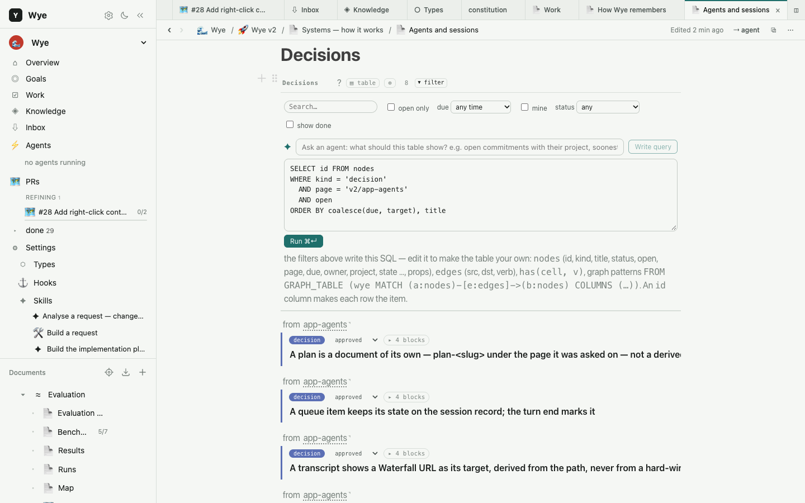

## Mind maps

A **map** page is the same knowledge as a canvas: its nodes are blocks and its links are the graph's edges. Add a
node, grow a child, draw a link and name it. Everything you draw is written back to the documents.

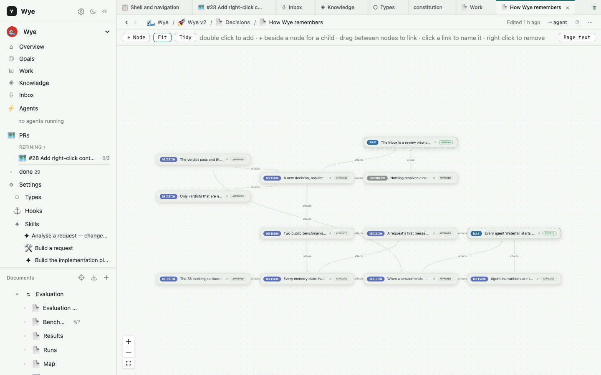

## Work

Tasks live wherever they make sense: under a requirement, in a design, in a Prompt Request, next to a decision. The
**Work** view collects them into one board, grouped by status, document, dependency or readiness. Each task belongs to
the knowledge that created it; the board is just another view over the graph.

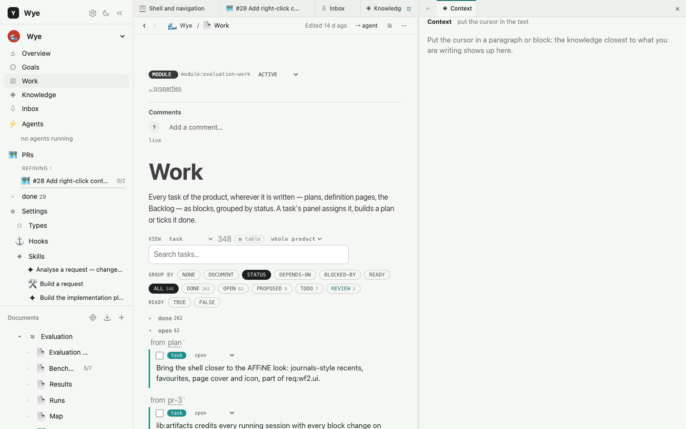

## Coding agents

Wye works with **Claude Code** and **Codex**. Two roles, deliberately kept apart:

```text
Librarian   understands and structures the change; never writes code
Worker      implements the approved change; never quietly redefines the product
```

Every running agent shows in the app's left rail with what it is doing. A click opens its conversation, where you
answer its questions.

Which model an agent runs and how much it does without asking is yours to set: **Settings › Agents** has, for each of
the two, a default model, a mode (ask, accept edits, auto, plan … up to skipping every check), an effort, and a line
for any other flag the CLI takes. A skill, a workflow or one stage can name its own model with `model:` on its card.

## Parallel work

Agents can work faster than people can keep overlapping changes in their heads, and two reasonable changes can each
modify the same product assumption.

Wye computes each request's scope and doesn't build overlapping Prompt Requests at the same time. It coordinates work
at the level of **product intent**, not only Git merge conflicts: a clean merge doesn't mean two product changes are
compatible.

## Wye uses Wye to build Wye

Wye's own product definition lives in [`data/products/wye/`](data/products/wye): its requirements, decisions, rules,
components and tests, in the same model the app offers every other product. A change to Wye starts by changing that
definition, and then

```bash
wye check --root data/products/wye
npm test
```

must pass. That's intentional dogfooding: the project should prove whether the model works by using it to evolve
itself.

## Getting started

Wye needs Node.js 20.9+ and **Claude Code (`claude`) or Codex (`codex`) installed and signed in**: it doesn't have its
own agent, it runs one of those.

```bash
npm install -g @emlab/wye
wye setup                                 # the home (~/.wye) and the Claude Code skills (~/.claude/skills)
wye init --product shop --repo ~/code/shop   # a first definition read from your code
wye app                                   # the app at http://localhost:3456
```

Your products live in `~/.wye/data/products/` (set `WYE_HOME` to put them elsewhere), and an update never touches
them. A product can also keep its documents next to its code: `root: <path>` in its `_product.md`.

**The first run.** With no products yet, `wye app` opens a Welcome: what Wye is in three steps, whether Claude Code or
Codex was found, and Add a product, which starts on **From your code** (`wye init` through the app: a title and a
folder). Every product then has a **Quick start** (`/<product>/start`, in the rail with its count): nine steps that tick
themselves as the product fills in, from a first document to a first build, each with the button that does it. Empty
pages say what they are for, and **Help** (`?` in the rail, ⌘/) lists the shortcuts and where everything is.

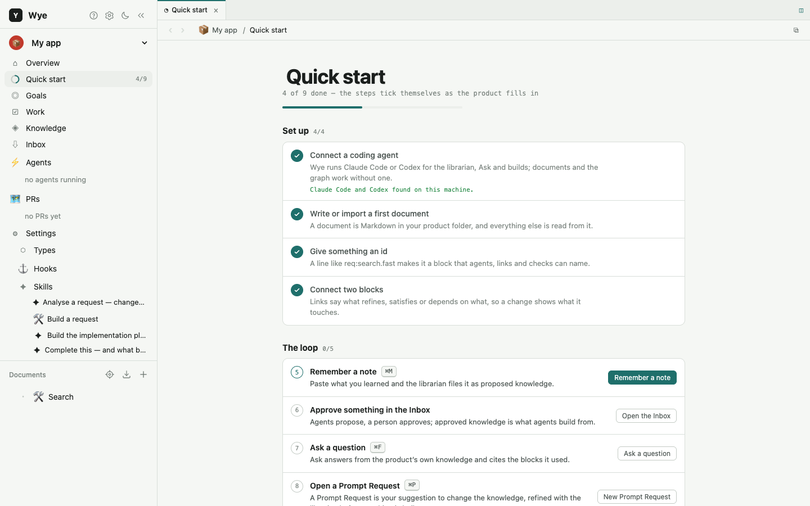

**Bring products in and out.** Add a product (the product menu, or `/new`) also offers **New**, **Open a folder**
(a product folder already on disk, used where it is, such as a teammate's clone or a repo that keeps its product in
`wye/`) and **Import a file** (a `.wye.tgz` made with Settings › Export). From the command line: `wye export <product>`,
`wye import <product>.wye.tgz`, `wye open <folder>`. An export carries the documents, the app's pages, the inbox and
agent instructions; agent sessions and change history stay on the machine that made them.

Without either, only the core works: the Markdown, the graph, `wye build` / `wye check` and the app's documents. The
librarian, builds, Ask's answers, Remember and contradiction checks all run through `claude` or `codex`. The first search downloads two small local models into `~/.wye/.cache/models`.

**From a clone**, to work on Wye itself:

```bash
git clone https://github.com/emlab-ai/wye.git && cd wye
npm install
./install.sh                              # the wye CLI into ~/.local/bin, the Claude Code skills into ~/.claude/skills
wye build --root data/products/wye && wye check --root data/products/wye
npm run dev                               # the dev server; or npm run desktop for the app in its own window
```

A clone is its own home: its products are in `data/products/`. The `wye` command, the desktop app and everything
else in detail are in [docs/reference.md](docs/reference.md).

## Repository structure

| path | what |
|---|---|
| `lib/` | the core: Markdown → nodes and edges, graph queries, impact, validation, the contradiction judge, `wye init` |
| `bin/` | the `wye` CLI |
| `packages/web/` | the app (Next.js) |
| `packages/desktop/` | the Electron shell |
| `schema/` | the base ontology |
| `prompts/` | the instructions Wye's agents follow |
| `skills/` | Claude Code skills that teach an agent to work with Wye |
| `templates/` | document templates |
| `data/products/wye/` | Wye's own product definition |
| `test/`, `eval/` | tests and benchmarks: parsing, ontology, memory, impact, verdicts |

## Data layout

```text
data/products/<product>/
├── _product.md                  title, icon, description
├── projects/<project>/
│   ├── _project.md
│   └── docs/*.md, docs/assets/  the documents
├── inbox/                       raw notes dropped for later filing
├── _sessions/                   agent sessions: instruction, log, result
├── _hooks/                      what hooks fired
└── _build/graph.json            generated: the graph, rebuilt after every save
```

`_build` is generated; the Markdown files are canonical.

## A node can be almost anything

```markdown
goal:pos.fast Every common interaction should feel immediate.

req:sale.close When the last kitchen item is completed, the order is closed.

- [ ] task:kitchen-screen Build the kitchen display.
```

```yaml
- id: decision:memory.bitemporal
  title: Keep historical product states
  status: approved
  supersedes: decision:memory.snapshot
  affects: [type:node, req:wf2.decisions]
```

The representation is deliberately light. Wye is not meant to turn product thinking into a heavyweight modelling
exercise: add structure where it gives leverage, and leave the rest as prose.

## What Wye is not

- **A new coding agent.** Wye doesn't write your code. Claude Code or Codex does, with the product's definition in
  front of it; Wye decides what goes into that first message and keeps what comes back.
- **A new agent harness.** Wye doesn't replace the tool that runs the agent: no new agent loop, tool system or model
  client. It starts the agents you already use (Claude Code or Codex, through their own command-line tools, with your
  login) and talks to them. **For now, that means Claude Code or Codex must be installed on the machine.**
- **A replacement for Git.** Git stays the history and the storage.
- **Another issue tracker.** Tasks exist, but the central object is product knowledge, not tickets.
- **A new programming language.** The output is ordinary software.
- **A giant prompt file.** Wye selects the knowledge relevant to a change instead of stuffing the whole product into
  an agent's context.
- **An autonomous product manager.** Agents analyse, connect and propose; important decisions stay visible to people.
- **A claim that all product knowledge can be formalised.** Products are messy. Some knowledge belongs in structured
  relationships, some in plain prose, and Wye lets both coexist.

## Why a graph?

Search answers *where is "refund window" mentioned?*. A graph answers different questions: *What does this
requirement affect? What implements it? Which decision governs it, and which newer decision superseded that one?
Which tests verify it? Which request is trying to change it?*

Those are relationships, not similar text. Semantic search is still useful, and Wye uses it, but similarity and
product structure solve different problems.

## Why Git?

A product definition changes for the same reason code does: someone made a decision. Keeping it in Git gives it
history, diffs, attribution, branches, review, rollback, portability, text tooling and local ownership almost for
free, and keeps it next to the implementation the agents are changing.

## Why not infer everything from code?

Code tells you a great deal about what a system **does**. It doesn't reliably tell you what the system **should do**.
A strange piece of behaviour might be a bug, or an important contractual requirement; the implementation alone often
can't tell an agent which. The definition keeps the intent that shouldn't have to be reverse-engineered on every
change.

## The experiment

Wye is early. It explores one question:

> **What should the interface between people and increasingly capable coding agents look like?**

One answer is to keep today's workflow and give agents bigger contexts. Wye explores another: as agents get better at
producing implementations, engineers may spend more of their time defining and evolving the system they want (its
users, goals, behaviours, rules, constraints, decisions and relationships) and less time translating it into code
by hand.

In that world the important artifact may not be the codebase alone, but the product definition, the implementation,
and the history of why they became what they are, together. Wye is an experiment in tooling for that world.

## Why the name?

A **wye** is the written name of the letter **Y**, and a Y-shaped junction where two flows meet:

```text
human flow  ─ what the product is for, what was asked, what was decided ─┐
                                                                          Y── shared product definition
agent flow  ─ what the code does, what the agent found, what it needs ────┘
```

It also sounds like **why**, which is a good place for any product change to begin.

## Status

Wye is early, local-first, open source, under active development, and used to build itself. The core workflow needs
no accounts and no hosted service. Expect the model, the interface and the APIs to change. The current version is
`0.2.0`.

## Contributing

If the idea interests you, contributions and criticism are welcome. Ideas and questions go to
[Discussions](https://github.com/emlab-ai/wye/discussions); bugs and the
[`good first issue`](https://github.com/emlab-ai/wye/issues?q=is%3Aissue+is%3Aopen+label%3A%22good+first+issue%22)
list to Issues. [CONTRIBUTING.md](CONTRIBUTING.md) explains how the repo works: since Wye describes itself, a change
starts as a block in `data/products/wye`.

The most useful feedback right now is not only *does this feature work?* but *is this actually a better way for people
and coding agents to work together?* Ideas, counterexamples and other models are all welcome.

## License

Apache License 2.0. See [LICENSE](LICENSE).

---

**In one sentence:** Wye gives people and coding agents a shared, version-controlled memory of what the product is,
why it works that way, and what is allowed to change.
