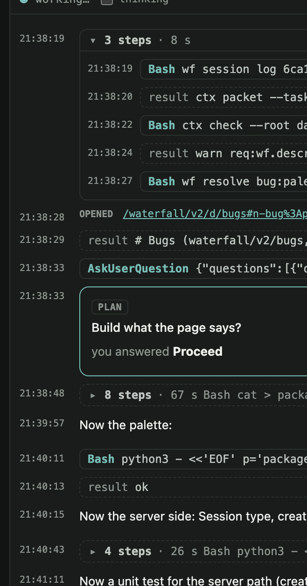
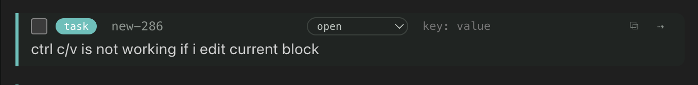

- [x] task:new-441 in session window if you can show size of context, and tokens spent already by agent - show it (session: 53f99bfd98)
- [x] task:new-917 if we have codex or claude process running it must be visible as live/active sessions, and rename sessions to agents (session: 6ca1fd641c)
- [x] task:new-453 we need to add. a section/block or page which can show us all cards of specific type with filter, i.e. if i want to show all pages, or all manager or all tasks .. (session: 53f99bfd98, produced: module:app-knowledge module:dev-design module:test-design module:app-documents module:app-graph module:app-shell module:app module:ontology module:scratch-view-block-test)
- [ ] task:new-954  do not show time stamp, it takes a lot of space #done
- [ ] task:new-226 make sure that each page is also a node, like any other block, and we can set type for it too, to choose properties
- [x] task:new-286 ctrl c/v is not working if i edit current block , so i can't copy text inside blcok, and can't paste
- [x] task:session-knowledge-changes Show which part of the knowledge base a session changed: per turn on the turn-done row (documents and nodes as tags, from the session's artifacts) and a live Knowledge strip in the session header. Part of req:wf2.sessions.knowledge-changes. Or this one we need to show in-memory page, with all blocks added / modified when task completed, for this we need to attach to all such blocks a run id (like commit hash), and filter by it (session: 6fdfc7ab9d 53f99bfd98, produced: module:scratch-attribution module:app-agents)
- [x] task:one-command-box One CommandBox for ⌘P and every Send-to-agent button: union of both dialogs (text, tags, images, to-picker defaulting to the live conversation, agent/folder/plan-first for a new one), Enter runs; remove SendToAgentHost and CommandPalette; refine the knowledge. Part of decision:wf2.one-command-box.
- [x] task:idle-agent-timeout because the goal of the waterfall is to be a memory of all agents and a knowldge, we must start every task from clear slate? if task has nothing to do with previouse task, we no need to reuse the same context, so clear state of execution agent (make a checkbox, smth clear context before next run), but if we chat with agent in context window keep context (session: 64813dfdab, produced: module:scratch-view-block-test module:app-knowledge module:dev-design module:test-design module:app-agents)
