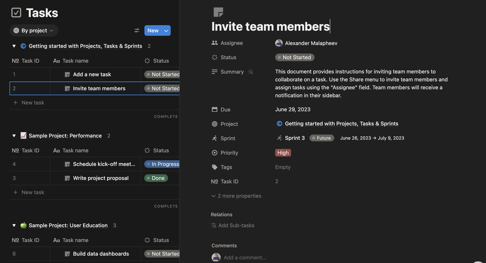

# Bugs

entity:new-649

Write here. An `id: kind:slug` inside a yaml block becomes a card; a `kind:slug` in the text becomes a tag.

```yaml
- id: module:bugs
  purpose: What this document covers, for whom.
```

bug:new-396 i should be able to insert image to the block content, i.e into a bug/task

<!-- list:bug -->
- bug:when-i-select-a When i select a bug in side bug table it must show bug card in teh context panel, the same way as bug blockasdf #done (priority: p1)
  - [ ] task:new-640 subtask 1the same data
  - [x] task:check-the-row-folds check the row folds in the table
- bug:no-need-to-add no need to add all types like "Bugs table", "managers table" etc, instead we need do add one generic datatable? and in the properteis add type #done
- bug:properties-need-to-be Properties must be editable on the card, like in Asana: text and every property, in the context panel #done (priority: p1)
- bug:palette-paste-images The ⌘P command box must accept pasted (and dropped) images the way the session composer does — a screenshot of what to fix travels with the request to the agent #done (priority: p1)
- bug:doc-tree-dnd Drag and drop in the sidebar Documents tree did nothing: the drag died on dragstart because the row component was defined inside the tree's render and every row was remounted on the first state change (fixed: the row is a module-level component, rule:doc-tree-row-stable) #done (priority: p1)
<!-- /list:bug -->

- [x] task:new-826  Card editor laid out like the screenshot: properties on top (session: 8aa3926e18)

## Plan: images in the command palette (bug:palette-paste-images)

question:wf2.bugs-cards-dropped The working copy of this document (edited after commit 47d14c8, before session 9091132439) had lost the two cards below — req:wf2.ui.palette-images and decision:wf2.palette-images-are-session-files — and its prose reflowed to one line, which looks like an editor save (component:doc-editor, rule:prose-round-trip) rather than a deliberate delete; the tasks under this heading still refine the req and `wye check` reported it as never described. Session 9091132439 restored the cards from the commit. Were they removed on purpose, or did a save drop them? #open

The session composer already takes images from the clipboard (action:send-message → store:session-files → base64 content blocks for Claude, `--image` for Codex). The command box (action:command-palette) does not: it only posts `instruction` text, and the session-create route (`packages/web/src/app/api/[product]/sessions/route.ts`) has no `images` field, so a pasted screenshot is dropped before the first message is ever built (`buildPrompt` in `packages/web/src/lib/agent-host.ts`). The fix reuses the composer's path end to end.

```yaml
- id: req:wf2.ui.palette-images
  title: A request from the command palette can carry images
  status: shipped
  refines: req:wf2.ui.command-palette
  satisfied-by: [action:command-palette, store:session-files]
  verified-by: [ui-test:command-palette]
```

  - when:wf2.ui.palette-images a person pastes or drops one or more images into the ⌘P command box before pressing Enter
  - then:wf2.ui.palette-images thumbnails appear under the text with a remove button (up to 8, like the session composer); on Enter the images are saved as the session's files (store:session-files) and reach the agent in the first message — Claude as image content blocks, Codex as --image paths, and as file paths listed under the instruction so an agent run by wye agent listen can read them — and the first user event in the console shows them
  - unless:wf2.ui.palette-images the clipboard holds no image (plain text pastes as before)

```yaml
- id: decision:wf2.palette-images-are-session-files
  title: Palette images are session attachments, not inbox assets
  date: 2026-09-17
  status: approved
  affects: [action:command-palette, store:session-files, req:wf2.ui.palette-images]
```

  - choice:wf2.palette-images-are-session-files The session-create route accepts `images` (name + data URL) and saves them with the same saveAttachment as the message route, into <id>-files; the session record lists their file names; buildPrompt lists their absolute paths under the instruction and startChat sends them as image content (Claude) or --image (Codex) with the first message, the way pump does for later messages.
  - context:wf2.palette-images-are-session-files Images pasted into a document become assets next to the document (store:assets); images sent in a chat become the session's files (store:session-files). A palette request is the first message of a chat session, so it must pick one of the two.
  - alternative:wf2.palette-images-are-session-files Store them as document assets in the open document's folder — wrong owner: the request may come from any page, and the image belongs to the session, not to the knowledge; or start the session empty and send the images as a second queued message — the agent would read the instruction without the screenshot it refers to.
  - consequence:wf2.palette-images-are-session-files One code path for attachments (Console and CommandPalette share the paste/drop/thumbnail logic); a runner session gets the images as paths it can open with Read; the Session type grows an optional `images` list.

- [x] task:palette-paste-ui Command box: paste and drop handlers, thumbnail strip with remove, Enter sends `images` with the request; the paste/thumbnail code shared with Console (one small hook or component). Part of req:wf2.ui.palette-images.
- [x] task:palette-images-api Session-create route accepts `images` (≤ 8, name + data URL), saves them with saveAttachment into store:session-files, keeps their names on the Session (`images`); buildPrompt lists the paths under the instruction; startChat sends them with the first message for Claude (content blocks) and Codex (--image) and the first console event shows them. Part of req:wf2.ui.palette-images.
- [x] task:palette-images-knowledge Refine action:command-palette (dev-design) and store:session-files (app-storage) to say palette images ride along; extend ui-test:command-palette with the paste step; a unit test for the route (images saved, session lists them, prompt mentions the paths). Part of req:wf2.ui.palette-images.
