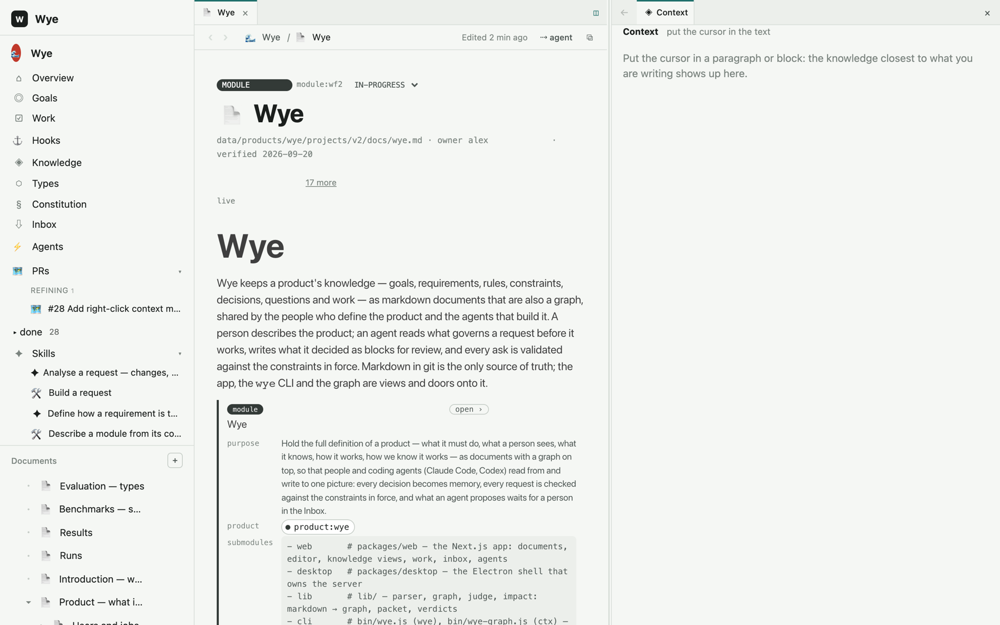
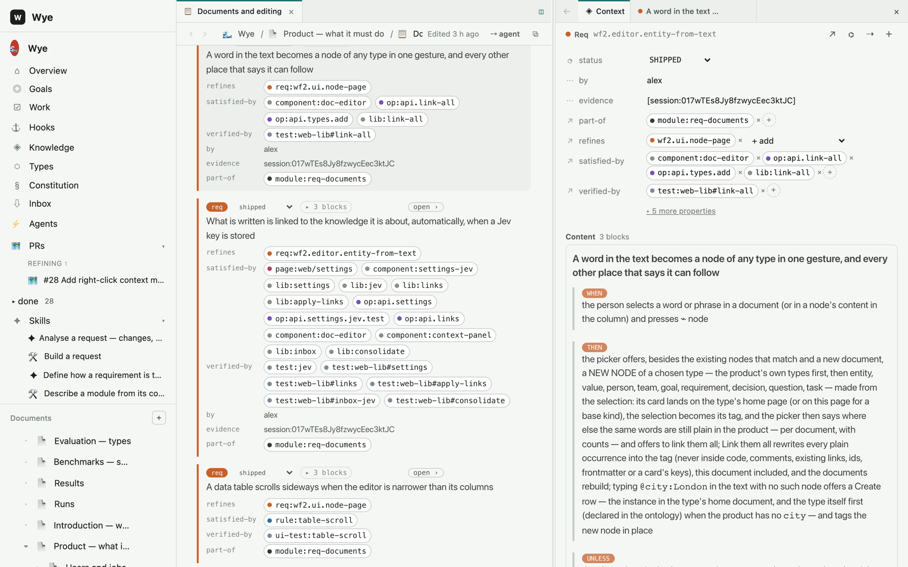
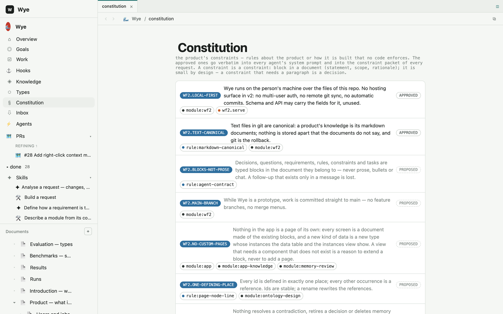
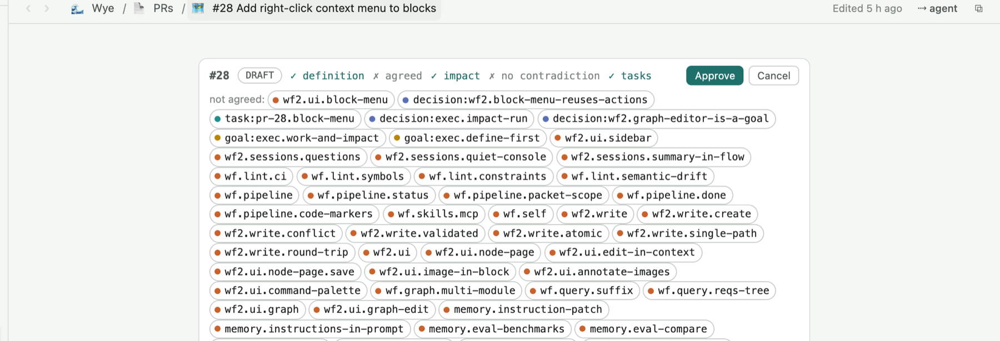
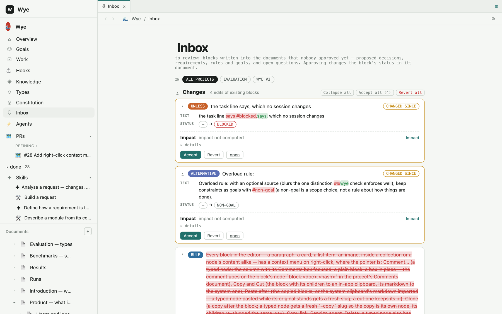
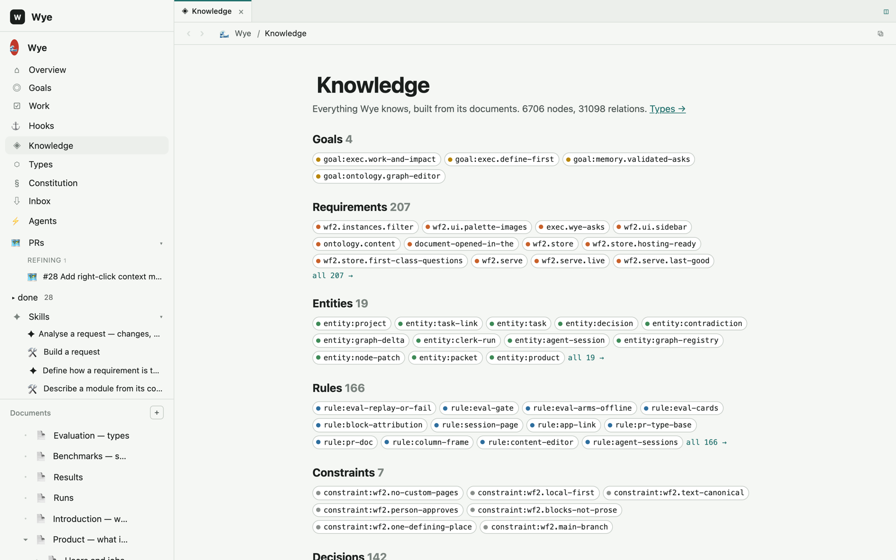
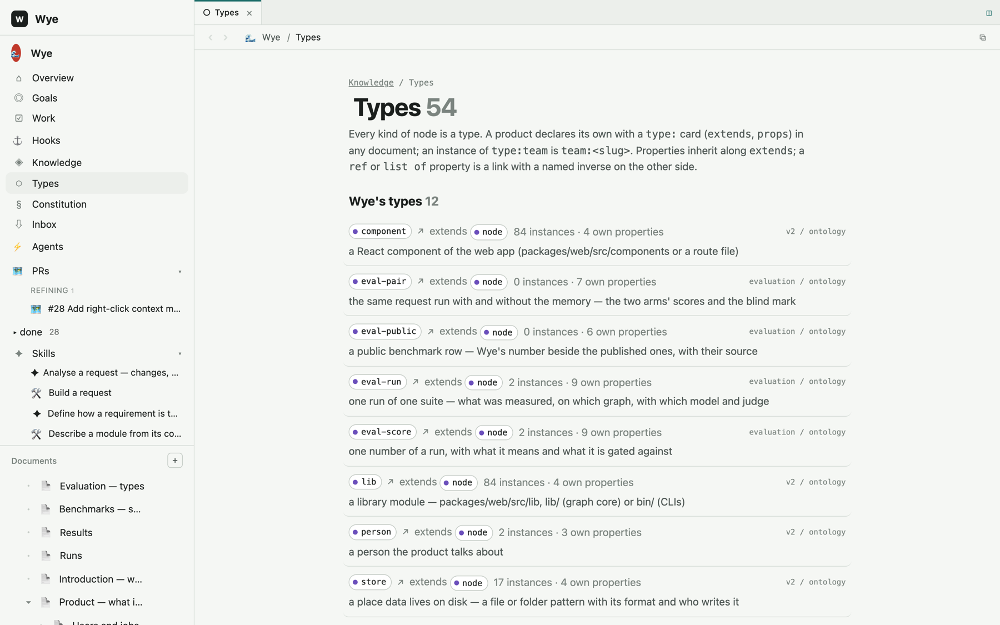
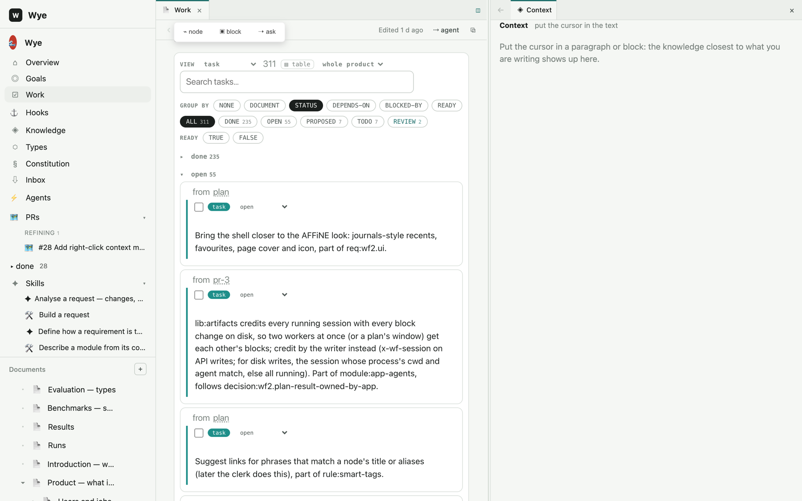

# Introduction — what Wye is and why

Wye is an editor for a product's **definition** — what it must do, what a person sees, what it knows, how it works,
what was decided and why — kept as markdown documents that are also a graph, shared by the people who define the
product and the coding agents that build it. A person describes the product; an agent reads what governs a request
before it works, writes what it decided as blocks for review, and every ask is checked against the constraints in
force. Markdown in git is the only source of truth; the app, the `wye` CLI and the graph are views and doors onto it.
The full definition is the tree under module:wf2; this page is the door.



## Why I built it

For me this started as a thought experiment, not a product: **what is the best future way for a human to interact
with agents?**

Agents already write most of the code. What they cannot do is know what the product is for, what a person really
asked, which decision is still in force and which was overturned last week. Today that knowledge lives in chat
histories, ticket comments and people's heads, and each new session starts from zero — the agent reads the code and
guesses the intent behind it.

My bet is that it makes sense to **stop thinking in terms of code** and instead be able to *describe and understand
the domain* — the users and their jobs, the behaviours, the rules, the entities, the decisions — and to **drive changes
to the domain, not to the code**. The code is an implementation detail an agent derives from the definition. What a
person owns is the definition.

That is why a PR in Wye is a **Prompt Request**, not a pull request (module:v2-prs). You do not review a diff of
code; you review a request: what was asked, what it touches, the requirements, decisions and constraints it
proposes, what it would break, the questions it raises. When the request is agreed, an agent builds it — and what it
produces comes back as blocks in the same documents, waiting for your approval in the Inbox.

The graph model is what makes this flexible. Every paragraph that starts with an id is a node; every link in its
text is an edge; every kind of node is a type a product can declare in a document (module:ontology). Requirements,
rules, decisions, entities, pages, components, tests, tasks — and whatever your product needs (`type:city`,
`type:eval-run`) — live in the same documents with the same mechanics, so a question like *what does this change
reach?* or *what governs this request?* is a graph traversal, not a search.

## What it looks like

**Requirements as cards.** A requirement is a block with `when` / `then` / `unless` children and typed links —
what refines it, what satisfies it (a component, an operation, a library), what verifies it (a test), who wrote it
and where the evidence is. `open ›` opens the node in the column with its relations editable in place.



**The constitution.** Constraints are product rules no code enforces. The approved ones go verbatim into every
agent's system prompt and into the constraint packet of every request.



**A Prompt Request.** One page per request: the head shows readiness (definition, agreed, impact, no contradiction,
tasks) and the person's Approve. The scope — every node the build may touch — is computed from the definition and
the structural impact, and overlapping PRs are not built in parallel.



**The Inbox.** Everything an agent (or you) wrote that nobody approved yet: proposed decisions, requirements, rules,
edits of existing blocks shown as diffs, open questions. Approving changes the block's status in its document — the
Inbox is a view, not a store.



**Knowledge and Types.** Everything the product knows, by kind; and every kind as a type with its properties,
instances and where it was declared.





**Work.** Every task wherever it was written — a plan, a PR, a definition page — as one board, grouped by status,
document, dependency or readiness.



## The loop

1. **Describe.** Write the product as documents — a PRD, a design, a test design — where the important things are
   typed blocks: `req:`, `rule:`, `decision:`, `constraint:`, `entity:`, `goal:`, `question:`, `task:`. Or start from
   code: `wye init` reads a repo into a shallow definition and `wye deepen` sends an agent to describe each module in
   the person's words.
2. **Ask.** ⌘P in the app, or *Send to agent* on any block. The app creates a Prompt Request page with what you asked,
   computes what it touches and the constraints in force, and hands it to a *librarian* — an agent whose only job is
   to refine the request with you: it asks questions (mirrored as cards on the page), proposes the blocks the request
   needs, runs impact, and never writes code.
3. **Approve.** Approve is the person's click, never the librarian's (constraint:wf2.person-approves). Readiness is
   computed: every proposed block agreed, impact known, no open contradiction.
4. **Build.** A dispatcher hands approved PRs to *worker* sessions (Claude Code or Codex, running in the product's
   repo) up to N in parallel when their scopes do not overlap. The worker's first message carries the constraint
   packet; it reads the graph with `wye`, writes what it decided as blocks, logs to its session and reports a result.
5. **Review.** What the build produced waits in the Inbox. Approve it and it is memory: the next request is checked
   against it.

## The basics: documents, nodes, links

**A document is a node.** Its front matter says which: `node: module:wf2`, `type: module`, `part-of: module:wf2-prd`,
`order: 13`. The document tree in the sidebar is the `part-of` relation. A document can be any type — a page of
`type:pr` is a Prompt Request, a page of `type:skill` is an instruction an agent follows.

**A paragraph that starts with an id is a node.** Its text is the node's text; links and bare ids in the text are
edges; the words before an id name the verb.

```markdown
req:sale.close When a sale is completed and all [kitchen items](entity:kitchen-item) are done, et:order is marked Closed. #proposed
rule:close-on-complete Closed only when every kitchen item is done; satisfied by op:close-sale and verified by test:sales#close.
- [ ] task:kitchen-screen Build the kitchen screen, part of req:sale.close (owner: alex, due: 2026-10)
goal:pos.fast Every tap is instant #on-track
```

`#status` sets the status, a trailing `(key: value, …)` group carries other properties, a checkbox line is a task
(`[x]` is done). The verb is read from the words before the id — *satisfied by*, *verified by*, *refines*, *part
of*, *governs*, *depends on* — otherwise the edge is `related-to`.

**A yaml card is a node with properties.** Both forms live in one file and the parser treats them alike.

```text
- id: decision:example.bitemporal
  title: Every node can say since when and until when it holds
  date: 2026-09-19
  status: approved
  supersedes: decision:example.snapshot
  affects: [type:node]
```

**Blocks under a node are its content.** Indented under a requirement, `when:` / `then:` / `unless:` blocks are its
trigger, outcome and exception; under a decision, `context:` / `alternative:` / `choice:` / `consequence:`. Each is
a node of its own the person keeps, edits or deletes.

**Every kind is a type, and the set is open.** `schema/base-ontology.md` declares the base kinds as `type:` cards —
`type:req`, `type:rule`, `type:entity`, `type:decision`, `type:constraint`, `type:goal`, `type:task`, `type:pr`,
`type:skill`, `type:hook` and the rest — each with its properties (`name: value type`), its inverses
(`satisfied-by … -(inverse)-> satisfies`) and its *shapes*, the checks `wye check` enforces in the type's own words
(`shipped requires verified-by`). A product adds its own types in any document with the same card form; an instance
of `type:city` is `city:london`, and its first instance creates the type's collection document.

```text
- id: type:eval-run
  extends: type:node
  purpose: one run of one suite — what was measured, on which graph, with which model and judge
  props:
    suite: string
    model: string
    scores: list of eval-score -(inverse)-> run
  shapes:
    done requires scores
```

**Links are typed edges with inverses.** `req:x satisfied-by op:y` puts `satisfies req:x` on `op:y` at build time;
`decision:new supersedes decision:old` fills `until` and `superseded-by` on the old one. Field names found in another
node's text become `mentions` edges, so *where is this field used?* is one query. Structural edges (`refines`,
`satisfied-by`, `verified-by`, `governs`, `part-of`, `depends-on`, …) are what impact and the constraint packet walk;
`mentions` and `related-to` are weak.

**Views are blocks over the graph.** `<!-- view:goal -->`, `<!-- view:constraint status=approved -->`,
`<!-- view:pr -->` render every node of a kind wherever it is defined — filterable, groupable, editable. Overview
pages are views, never lists kept by hand; a block has one home and everywhere else it is an embed or a row of a view
(constraint:wf2.one-defining-place).

**In the app:** `@` inserts a tag for any node or document, select a phrase and press *⌁ node* to link it or make a
new node of any type from it, `/` inserts a typed block, right-click a block for comment / copy / cut / paste / clone
/ send to agent. Every save rebuilds the graph and diffs it against the last build, so each block knows who changed
it and when — the person or an agent session.

## Memory

Wye is memory for agents, and the memory is honest by construction rather than by recall (module:memory):

- **Constraints are computed, not found.** A request's first message carries the constraints in force: every
  `rule:`, `constraint:`, `gate:`, approved `decision:` and `goal:` within two hops of what the request touches, plus
  every open `question:` on them — a graph traversal from the seeds, complete by construction. Vector search only
  finds the seeds; it is never the authority on what governs. `wye packet --for "<text>"` gives the same mid-session.
- **Time is on every node.** `since`, `until`, `superseded-by`, `by`, `evidence`. Current means not ended; superseded,
  rejected and retired knowledge is excluded from context unless you ask (`--all`, `--as-of <date>`). A decision that
  supersedes another retires the old one in one act.
- **Contradictions are found at write time.** A new decision, requirement, rule or constraint is classified against
  its neighbours (duplicate / refines / consistent / contradicts) when it is written, and the verdicts sit on the
  node; approving a block with an open contradiction requires choosing — supersede the other side, refine this one,
  or dismiss with a reason. `wye check --strict` fails on an open contradiction touching shipped work.
- **Impact before edit.** `wye impact <id> --after "<new text>"` lists what an edit reaches and what each reached
  node needs — unaffected, update, rework, contradicts, ask — before anything is written.
- **Status is earned.** `shipped` needs a `verified-by`; a rule needs a `source`; a superseded node names its
  successor. `wye check` says so.

The Evaluation project measures this against public memory benchmarks and against Wye's own history — with and
without the memory — so the claims above have numbers.

## Prompt Requests

Every request is a document of `type:pr` under the project's PRs page: `pr-<n>.md`, shown as `#n Title`.

```
## Request      what was asked, in the person's words, with the refs attached
## Context      what it touches — modules, documents, nodes, code — and what was understood
## Definition   the blocks it proposes, defined in their home documents and embedded here
## Impact       what the change reaches, computed from the Definition; the PRs it overlaps
## Questions    the librarian's questions, answered on the page
## Tasks        `- [ ] task:` lines, part of the PR
## Result       written by the app when the build ends: summary and the blocks produced
```

Lifecycle: `draft → refining → approved → building → done | failed | cancelled`. The librarian refines; the person
approves; the dispatcher builds. From the terminal: `wye pr <product/project/pr-x>`, `wye pr approve|cancel|reopen`,
`wye pr build --worker claude-code|codex`.

## Skills and hooks

A **skill** is an instruction a session follows — a document under the project's Skills page, editable in the app
like any other. A **hook** is a card in the project's Hooks document — `when <kind>.<event> [where …] do run <skill>
| add <template> | assign | notify` — and the engine runs it on the watcher, on approve and at session end; what
fired is on the Hooks page and in `wye hooks`.

The Claude Code skills in the repo's `skills/` folder teach an agent the contract from the other side:
`wye-agent` (resolve a Wye link or id, read and write documents and nodes, report on a session),
`wye-context` (query the graph before code, describe the change before building, `wye check` before done),
`wye-describe-module` (the inventory process behind `wye deepen`), `wye-restore` (continue a session by id).

## The command line

`wye` is the one command (decision:wf2.cli-is-wye): the agent's and the person's door into the running app
(`WYE_URL`, default `http://localhost:3456`; `WYE_PRODUCT`, `WYE_SESSION`), and the graph itself without the app.

**The graph, no app needed:**

| command | what |
|---|---|
| `wye build [--root dir]` | parse the documents → `_build/graph.json` |
| `wye check [--root dir] [--strict]` | lint: shapes per type, dangling references, missing sources, open contradictions; exit 1 on errors |
| `wye get <id>` | one node with every edge (`wye get oversell` resolves suffixes) |
| `wye search <terms>` | ranked search over ids, titles, bodies |
| `wye reqs [--status s]` | the requirement tree with status glyphs (● tested ◐ untested ○ proposed ? question) |
| `wye stats` | counts by kind, verb, status |
| `wye site [--out dir]` | the phone-first viewer (index.html + data.js, no server) |
| `wye graph neighbors <id> [-d N]`, `wye graph impact <id>`, `wye graph packet --task "…" [--budget N]`, `wye graph constraints`, `wye graph verdicts` | neighbourhood by hops; reverse structural closure; a token-budgeted slice for a task; the constraints; the verdict log |

**Reading and writing through the app:**

| command | what |
|---|---|
| `wye resolve <link\|id>` | what a Wye link or id points at — document, node, block or section — text included |
| `wye doc <p/proj/doc>` · `wye doc write` · `wye doc create` · `wye doc retype` | a document's body; replace it (or one `## section`) checked against the current hash; a new page of a type; change its type |
| `wye node <id>` · `wye node set` · `wye node content` · `wye node add <type>:<slug>` | a node with its relations; set status / text / properties; its content blocks; a new instance of a type |
| `wye type add <slug> [--extends parent]` | a proposed type card |
| `wye context "<text>"` | the knowledge closest to a text (local semantic search; ended nodes hidden) |
| `wye packet --for "<text>" [--ref id]` | the constraints in force for a text — complete, two hops |
| `wye impact <id> --after "<new text>"` | what an edit would reach and what each reached node needs; nothing written |
| `wye verdicts <id …>` | classify nodes against their neighbours now |
| `wye explain <id \| "text">` | the current state of the product around a node or a text (the librarian, one turn) |
| `wye inbox add\|list` | raw notes for later filing; what waits for review |
| `wye propose --pr <p/proj/pr-x>` | one proposed block into the document where its kind lives, embedded on the PR's Definition |
| `wye pr <p/proj/pr-x> [--status …]` · `wye pr approve\|cancel\|reopen` · `wye pr build [--worker …]` | a PR's status, definition and readiness; the person's moves; hand it to a worker |
| `wye work list\|add\|next\|assign` | every task with its state; a backlog line; the oldest ready task; assign to a person or agent |
| `wye session list\|show\|changes\|create\|log\|done\|fail\|handoff\|open\|take` | sessions and their logs; every block a session changed; the worker's lifecycle |
| `wye skills` · `wye skill <id>` · `wye hooks [--node id]` | the product's skills; one skill's instruction; the hooks and what fired |
| `wye init --product <slug> --repo <dir>` | a product's definition from its code, first pass: the layered tree, every module / page / component / library / operation / test, a `#ready` describe task per module — no model, nothing overwritten |
| `wye deepen <module> --product p` | assign the module's describe task to a worker: requirements from the code, each mapped to the file that delivers it |
| `wye agent listen --product p --agent claude-code\|codex` | a runner: pick up queued sessions, run the agent with the prompt on stdin, stream the output to the session |
| `wye eval own\|compare\|public\|judge\|report` | the benchmarks |

`wye --help` prints all of it with every flag.

## Where it lives

```
data/products/<product>/_product.md                       title, icon, description
data/products/<product>/projects/<project>/_project.md    title, kind (project | goal), status
data/products/<product>/projects/<project>/docs/*.md      the documents — each a page in the app and a node in the graph
data/products/<product>/projects/<project>/docs/assets/   images pasted into documents
data/products/<product>/inbox/                            raw notes dropped for later filing
data/products/<product>/_sessions/                        agent sessions: instruction, log, result
data/products/<product>/_hooks/                           what hooks fired
data/products/<product>/_build/graph.json                 generated: the product's graph, rebuilt after every save
```

Wye's own definition is `data/products/wye` — the app is described in itself, and every change to it goes
through the loop above. Install: `npm install && ./install.sh` links `wye` and the skills; `npm run dev` runs the
app; `npm run desktop` opens it in its own window (module:app-shell).
