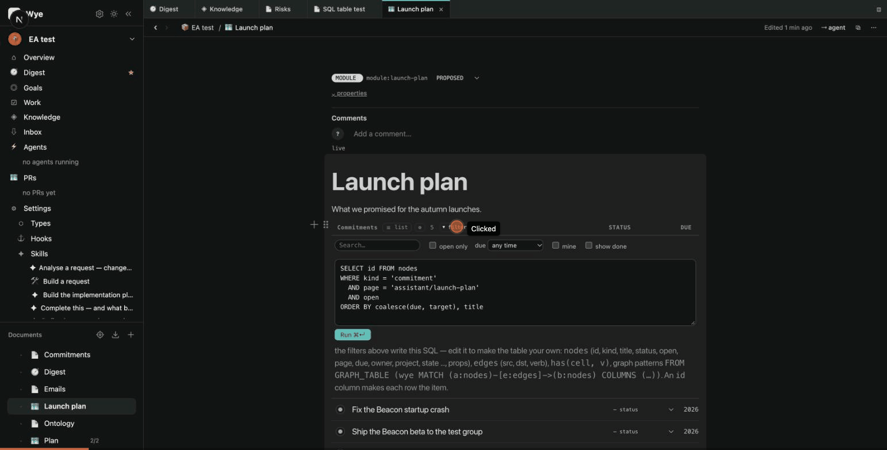

# Querying the graph

Every Data table and Data list in Wye is a SQL query over the product's graph. A new table on a page asks for this
page's open items of its kind; each filter you switch on adds a line to that query; and you can edit the query
yourself: join items to the items they link, look things up across the product, follow edges with graph patterns.



Nothing about storage changes. The markdown files stay the only source; Wye loads the graph it already builds into
an in-memory [DuckDB](https://duckdb.org) and reloads it when the graph changes. Queries only read: file and network
access are off, and one `SELECT` / `WITH` / `FROM` statement runs at a time.

## A table's SQL

Open **⏷ filter** in a table's header. Under the switches (search, open only, due, mine, status, show done) is the
SQL they make. A new tasks table on the page `plan` in the folder `v2`:

```sql
SELECT id FROM nodes
WHERE kind = 'task'
  AND page = 'v2/plan'
  AND open
ORDER BY coalesce(due, target), title
```

- **Filters write SQL.** "due within 7 days" adds `AND try_cast(due AS DATE) <= current_date + 7`, "mine" adds
  `AND has(owner, '<you>')`, a search adds `AND (title ILIKE '%…%' OR text ILIKE '%…%')`, a status replaces `open`.
- **⊕ whole product** drops the `page = …` line: the table shows the items of the kind from everywhere.
- **Edit the SQL and Run (⌘↵).** The query is now the table's own: it is saved on the table's marker in the page,
  the switches step aside, and **Back to filters** returns to them.

### Ask an agent for the query

Above the SQL is **✦ Ask an agent**: say what the table should show, in words ("open commitments with their project,
soonest first", "Lee's and Dana's, by owner") and press Enter or **Write query**. A quick Claude call (no tools) writes
the query from this product's real columns, kinds and link verbs, and from the table's kind, page and current SQL, so
it can refine what is there. The server runs it before handing it back; a query that fails goes back to the agent once
with the error. The query lands in the box and the table runs it; edit it or go **Back to filters** as with any query.
It needs the `claude` command line signed in (as the rest of Wye's agents do); `WYE_ASK_MODEL` picks the model.

### What the rows are

- **A result with an `id` column is items.** Each row opens the item, and its status changes in place. When the
  query selects only `id`, the table shows the kind's own columns. When it selects more, the table shows exactly
  those: a column that is the item's own property (`c.owner`, `c.due`) stays editable, and a joined value
  (`p.title AS project`) only shows.
- **Edits go where the item lives.** An item defined on this page is changed in the page you are editing; one from
  another page is changed in its own file.
- **New rows.** A table on a page ends with **New task…** (or the table's kind): the item is written under the
  table's marker in this page, as a line like any other. A table of the whole product only shows.
- **A result without `id`** (counts, groups) is a plain read-only table.

## Tables

| table | columns |
|---|---|
| `nodes` | `id`, `kind`, `title`, `status`, `open` (false once done, met, answered …), `folder`, `page` (`folder/slug` of the page it is on), `file`, `text`, `props` (JSON of every property), and one column per property in use or declared: `due`, `owner`, `state`, `target`, `project`, `part_of` … (`-` becomes `_`; a keyword like `from` is quoted: `"from"`) |
| `edges` | `src`, `dst`, `verb` (`part-of`, `project`, `to`, `mentions`, `related-to` …) |

`has(cell, v)` is true when a cell is `v` or a list `[a, b]` that holds `v` (owners, attendees, tags).

## Examples

Open commitments with their project:

```sql
SELECT c.id, c.due, c.owner, p.title AS project
FROM nodes c JOIN nodes p ON p.id = c.project
WHERE c.kind = 'commitment' AND c.open
ORDER BY c.due
```

What links to a project, by verb:

```sql
SELECT e.verb, n.kind, count(*) AS links
FROM edges e JOIN nodes n ON n.id = e.src
WHERE e.dst = 'project:atlas'
GROUP BY ALL ORDER BY links DESC
```

Risks per project, as a graph pattern ([SQL/PGQ](https://duckpgq.org), through the DuckPGQ extension):

```sql
SELECT project, count(*) AS risks
FROM GRAPH_TABLE (wye
  MATCH (r:nodes)-[e:edges]->(p:nodes)
  WHERE r.kind = 'risk' AND p.kind = 'project'
  COLUMNS (p.title AS project))
GROUP BY project ORDER BY risks DESC
```

Tasks of mine that are late, wherever they were written:

```sql
SELECT id, due, page FROM nodes
WHERE kind = 'task' AND open AND has(owner, 'person:me') AND try_cast(due AS DATE) < current_date
ORDER BY due
```

## From the command line and the API

```sh
wye query "SELECT kind, count(*) AS n FROM nodes GROUP BY kind ORDER BY n DESC"
wye query "<SQL>" --json
```

`POST /api/<product>/query` with `{ "sql": "…" }` returns `{ columns, rows, truncated, ms }` (at most 1000 rows), or
422 with the engine's message. Agents' instructions name `wye query` for exact questions over the graph.

## Notes

- DuckDB is pinned at 1.5.4, the newest release with a DuckPGQ build. The graph extension downloads on first use and
  is cached; without it (offline the first time), plain SQL and joins still work and `GRAPH_TABLE` does not.
- A query is kept on one line in the table's marker (`<!-- tasks sql="…" -->`); it cannot contain `-->`.
