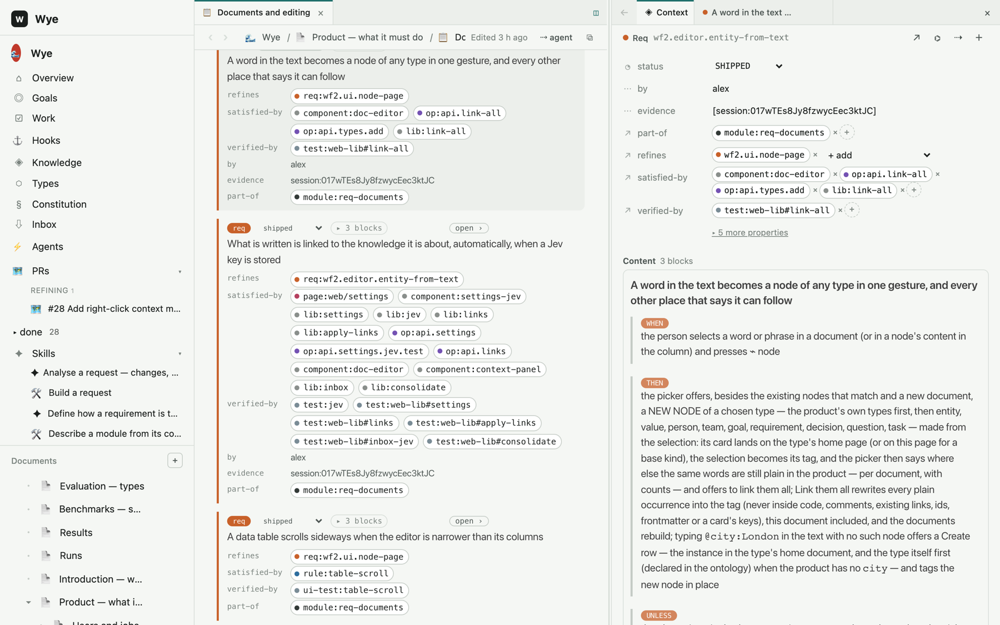
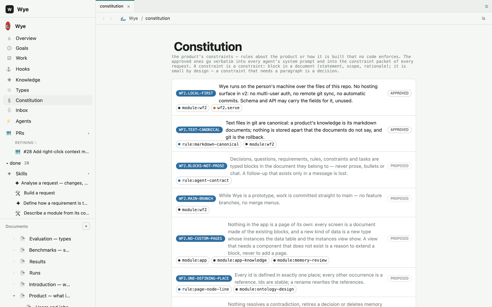
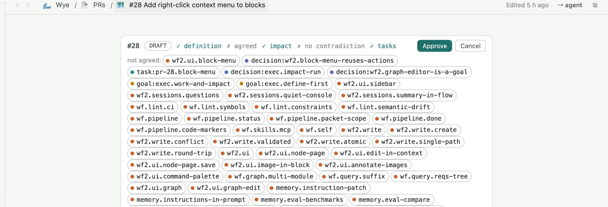
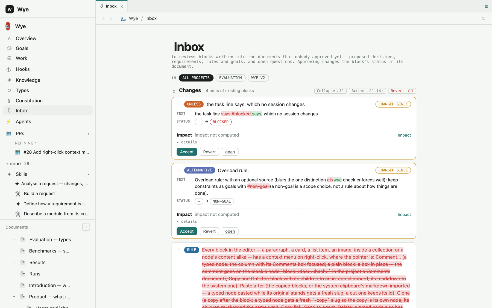
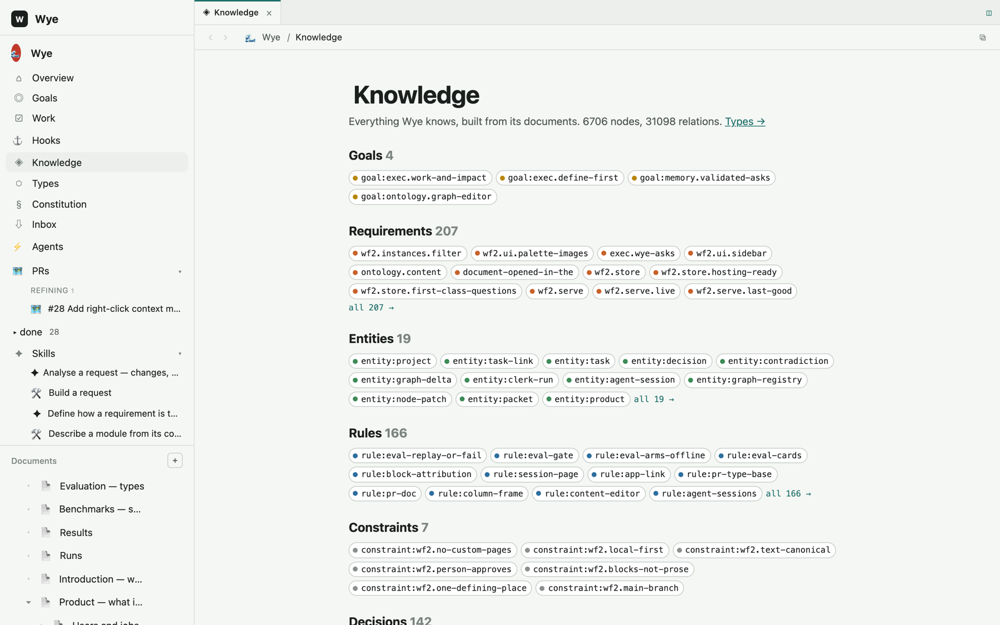
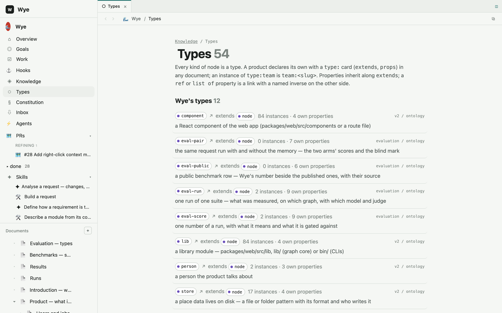
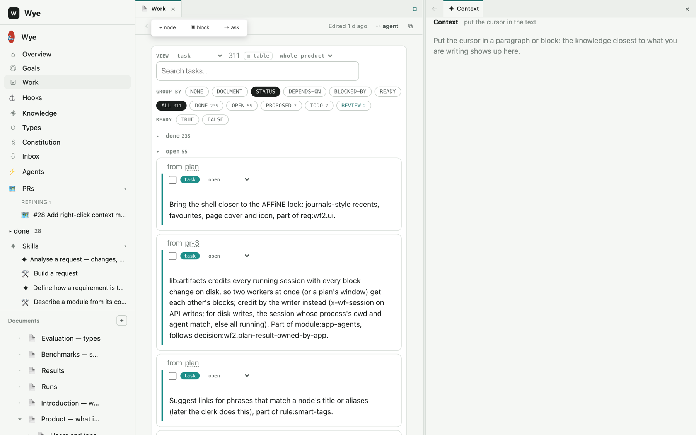
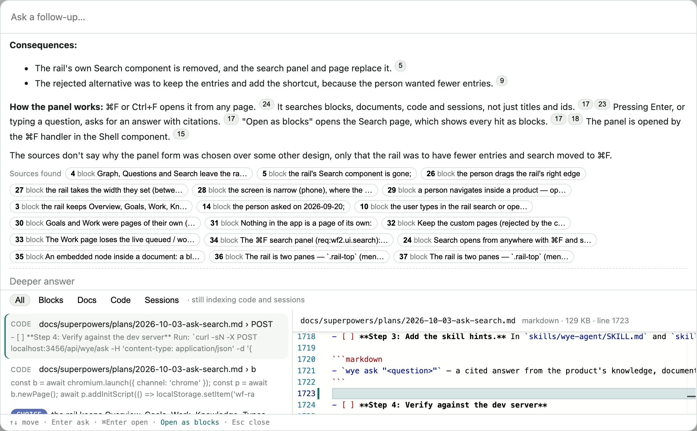
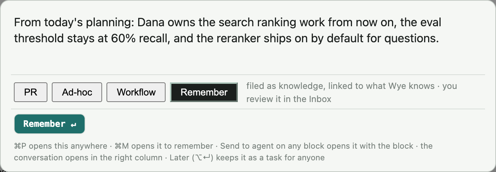

# Wye reference

The detail behind the [README](../README.md): the screens, the document syntax, how memory works, the Prompt Request
page, skills, hooks and workflows, the command line, the repository layout and the desktop app. The type system has
its own page, [type-system.md](type-system.md), and so do queries, [query.md](query.md).

## What it looks like

**Everything is a graph.** A document is a list of blocks; every block is a node with a **type** — a requirement, a
decision, a fact, a city, or just `block` for a plain paragraph — with properties, links and content. A link in a
sentence is an edge; a property whose value is another node is an edge with a named inverse the parser fills in;
the words before an id are the verb. The types themselves are cards in the documents, so a product's vocabulary is
open: declare `type:city` on the Ontology page and `city:london` is a node the moment the graph rebuilds. The full
story — declaring types, value types, inverses, shapes, where instances live — is in
[docs/type-system.md](type-system.md).

```markdown
req:sale.close When a sale is completed and all [kitchen items](entity:kitchen-item) are done, et:order is marked Closed. #proposed
  - when:sale.close the last kitchen item of the sale is completed
  - then:sale.close the order is marked Closed and the table freed
```

Three lines, three nodes: the requirement and its `when` and `then` content blocks; two edges out of the sentence,
to `entity:kitchen-item` and to `et:order` (an alias); a status. `wye check` will ask for a `satisfied-by` and, once
shipped, a `verified-by`.

**Requirements as cards.** A requirement is a block with `when` / `then` / `unless` children and typed links —
what refines it, what satisfies it (a component, an operation, a library), what verifies it (a test), who wrote it
and where the evidence is. Click `open ›` and the node opens in the column with its relations editable in place.



**The constitution.** Constraints are product rules no code enforces. The approved ones go verbatim into every
agent's system prompt and into the constraint packet of every request.



**A Prompt Request.** One page per request: the head shows readiness (definition, agreed, impact, no contradiction,
tasks) and the person's Approve. The scope — every node the build may touch — is computed from the definition and
the structural impact, and overlapping PRs are not built in parallel.



**The Inbox.** Everything an agent (or you) wrote that nobody approved yet: proposed decisions, requirements, rules,
edits of existing blocks shown as diffs, open questions. Approving changes the block's status in its document — the
Inbox is a view, not a store.



**Knowledge and Types.** Everything the product knows, by kind; and every kind as a type with its properties,
instances and where it was declared.





**Tables are queries.** Every Data table and list runs SQL over the graph: a new one shows this page's items of its
kind, each filter adds a line, and you can edit the query — join items to the items they link, look across the
product, follow edges with graph patterns. In-memory DuckDB over the graph Wye already builds; storage does not
change. More in [docs/query.md](query.md).


**Work.** Every task wherever it was written — a plan, a PR, a definition page — as one board, grouped by status,
document, dependency or readiness.



**Ask — search that answers.** ⌘F from anywhere. Typing ranks passages from the product's blocks, documents, code and
agent sessions (tabs narrow it; `req:` or `decision:` narrows to one kind; a typed id comes first). A question — or
Enter — gets two answers at once: a fast one in a few seconds, written from the best passages with numbered
citations, and a deeper one from an agent that searches, follows the graph and reads the code while you watch the
sources it opens appear under the answer. A citation opens the exact block, passage, code lines or session.



**Remember — memory you paste.** ⌘M (Ctrl+M in a browser) opens the box ready to paste. Wye's librarian splits what
you pasted into single statements, finds what each is about, and writes it where it belongs: a detail added to the
block that already holds it, a newer state as a block that *supersedes* the old one (history kept), a new fact,
decision, commitment or question in its home document, linked to the people, projects and requirements it concerns.
What it cannot place it asks about. Everything it writes is proposed and waits for you in the Inbox.



**Agents in the rail.** Every agent running in the product is a row under **Agents** in the left rail — working,
idle, waiting for your answer or queued for a slot, what it works on, what it is doing now, for how long — and a
click opens its conversation. A block opened in the column has its tools in one row on top: open its document, show
it in the graph, send it to an agent, capture a task, and delete it (one click arms, the second deletes; the removed
text stays in a change record).

## The loop

1. **Describe.** Write the product as documents — a PRD, a design, a test design, whatever — where the important
   things are typed blocks: `req:`, `rule:`, `decision:`, `constraint:`, `entity:`, `goal:`, `question:`, `task:`.
   Or start from code: `wye init` reads a repo into a shallow definition and `wye deepen` sends an agent to describe
   each module in the person's words.
2. **Ask.** ⌘P in the app (or "Send to agent" on any block). The app creates a Prompt Request page with what you
   asked, computes what it touches and the constraints in force, and hands it to a *librarian* — an agent whose only
   job is to refine the request with you: it writes a **Summary** first — what will be built (the content and the code
   changes, each sized), how it works, an example of the result, the plan, what is out of scope — asks questions
   (mirrored as cards on the page), proposes the blocks the request needs, keeps the Summary and the Analysis current
   after every answer, runs impact, and never writes code.
3. **Approve.** Approve is the person's click, never the librarian's. Readiness is computed: every proposed block
   agreed, impact known, no open contradiction.
4. **Build.** A dispatcher hands approved PRs to *worker* sessions (Claude Code or Codex, running in the product's
   repo) up to N in parallel when their scopes do not overlap. The worker's first message carries the constraint
   packet; it reads the graph with `wye`, writes what it decided as blocks, logs to its session and reports a result.
5. **Review.** What the build produced waits in the Inbox. Approve it and it is memory: the next request is checked
   against it.

## Install and run

**From npm** (to use Wye):

```bash
npm install -g @emlab/wye          # Node.js 20.9+; Claude Code or Codex installed and signed in for the agents
wye setup                          # the home (~/.wye: data/products yours, the code linked to the package) and the Claude Code skills
cd ~/code/shop && wye init         # a vault: this folder's knowledge in .wye/, a note to agents in AGENTS.md / CLAUDE.md
wye app ~/code/shop                # the app in its own window on that folder (--browser: http://localhost:3456)
npm install -g @emlab/wye@latest && wye setup    # update: the vault and the home's data are never touched
```

Vaults, workspaces, the home and what `wye init` writes: [workspaces-and-vaults.md](workspaces-and-vaults.md).

**From a clone** (to work on Wye):

```bash
git clone https://github.com/emlab-ai/wye.git && cd wye
npm install
./install.sh              # links `wye` into ~/.local/bin and the Claude Code skills into ~/.claude/skills
wye build --root data/products/wye && wye check --root data/products/wye
npm run dev               # the app at http://localhost:3000 (npx --workspace=packages/web next dev -p 3456 for the port the CLI and desktop expect)
```

A clone is its own home: its products are in `data/products/`. `npm run desktop` opens the app in its own window
(Electron); it starts the server on 3456 if none is running and quits it on exit — see [Desktop app](#desktop-app)
for the installable `Wye.app` / AppImage. Wye's own definition lives in `data/products/wye` — the app is described
in itself, and every change to it goes through the loop above.

### First run and the Quick start

With no products, `/` is the Welcome; otherwise it opens the first product. Add a product (`/new`, `?way=code|new|open|import`)
starts on **From your code**: `POST /api/products { title, icon?, repo }` makes the product and reads the folder the way
`wye init` does (`lib/init.js`: no model, nothing in the folder changed), then builds the graph; a missing folder or a
file answers 422 `{ error: 'invalid', message }` and leaves nothing behind (`~` is the home folder). Without `repo`
it makes an empty product; with `folder` (the New form's optional field) the product's documents live in that folder,
`root:` in its `_product.md`, rather than in Wye's data — the folder is made if it is not there. Every way lands on `/<product>/start`.

The Quick start is an app route, not a document — nothing is written into the product. Its nine steps (`agent`,
`document`, `block`, `link`, `remember`, `approve`, `ask`, `pr`, `build`) are computed from the built graph on each
request: a document is a page under a project's `docs/` (not `.wye/`), a block a defined node with an id written in
one (not a page node, a hidden kind or a card's part), a link a written edge between two blocks. `remember` and `ask`
are marked when the app does them. `GET /api/<product>/onboarding` answers `{ steps, done, total, next, complete,
dismissed, show, agents: { claude, codex } }`; `POST` takes `{ mark?: <step>, dismissed?: boolean }`. The marks and
the dismissal belong to this machine: `<data>/_settings.json` holds `onboarding: { <product>: { done: [...],
dismissed } }`, so they never reach Git or an export. The rail shows Quick start with its count, and the Overview a
card, until all nine are done or it is dismissed; Help (`?`, ⌘/) opens it again.

### Data layout

A vault is this same folder as `<repo>/.wye/` — plus `_agent.md` (the folder's instructions to agents), `parent:`
and `vaults:` in `_product.md` (the links to the vaults above and below), `_changes/` (the change history) and a
`.gitignore` for `_build/`, `_sessions/`, `_changes/`, `_hooks/`, `_impact/`.

```
data/products/<product>/_product.md                       title, icon, description
data/products/<product>/projects/<project>/_project.md    title, kind (project | goal), status
data/products/<product>/projects/<project>/docs/*.md      the documents — each a page in the app and a node in the graph
data/products/<product>/projects/<project>/docs/assets/   images pasted into documents
data/products/<product>/inbox/                            raw notes dropped for later filing
data/products/<product>/_sessions/                        agent sessions: instruction, log, result
data/products/<product>/_hooks/                           what hooks fired
data/products/<product>/_build/graph.json                 generated: the product's graph, rebuilt after every save
```

## The basics: documents, nodes, links

(The reference for all of this is [docs/type-system.md](type-system.md); the `docs/` folder is the place for
the deeper pages.)

**A document is a node.** Its front matter says which: `node: module:wf2`, `type: module`, `part-of: module:wf2-prd`,
`order: 13`. The document tree in the sidebar is the `part-of` relation. A document can be any type — a page of
`type:pr` is a Prompt Request, a page of `type:skill` is an instruction an agent follows.

**A paragraph that starts with an id is a node.** Its text is the node's text; links and bare ids in the text are
edges; the words before an id name the verb.

```markdown
req:sale.close When a sale is completed and all [kitchen items](entity:kitchen-item) are done, et:order is marked Closed. #proposed
rule:close-on-complete Closed only when every kitchen item is done; satisfied by op:close-sale and verified by test:sales#close.
- [ ] task:kitchen-screen Build the kitchen screen, part of req:sale.close (owner: alex, due: 2026-10)
goal:pos.fast Every tap is instant #on-track
```

`#status` sets the status, a trailing `(key: value, …)` group carries other properties, a checkbox line is a task
(`[x]` is done). The verb is read from the words before the id — *satisfied by*, *verified by*, *refines*, *part
of*, *governs*, *depends on* — otherwise the edge is `related-to`.

**A yaml card is a node with properties.** Both forms live in one file and the parser treats them alike.

```yaml
- id: decision:memory.bitemporal
  title: Every node can say since when and until when it holds
  date: 2026-09-19
  status: approved
  supersedes: decision:memory.snapshot
  affects: [type:node, req:wf2.decisions]
```

**Blocks under a node are its content.** Indented under a requirement, `when:` / `then:` / `unless:` blocks are its
trigger, outcome and exception; under a decision, `context:` / `alternative:` / `choice:` / `consequence:`. Each is
a node of its own the person keeps, edits or deletes.

**Every kind is a type, and the set is open.** `schema/base-ontology.md` declares the base kinds as `type:` cards —
`type:req`, `type:rule`, `type:entity`, `type:decision`, `type:constraint`, `type:goal`, `type:task`, `type:pr`,
`type:skill`, `type:hook` and the rest — each with its properties (`name: value type`), its inverses
(`satisfied-by … -(inverse)-> satisfies`) and its *shapes*, the checks `wye check` enforces in the type's own words
(`shipped requires verified-by`). A product adds its own types in any document with the same card form; an instance
of `type:city` is `city:london`, and its first instance creates the type's collection document.

```yaml
- id: type:eval-run
  extends: type:node
  purpose: one run of one suite — what was measured, on which graph, with which model and judge
  props:
    suite: string
    model: string
    scores: list of eval-score -(inverse)-> run
  shapes:
    done requires scores
```

**Links are typed edges with inverses.** `req:x satisfied-by op:y` puts `satisfies req:x` on `op:y` at build time;
`decision:new supersedes decision:old` fills `until` and `superseded-by` on the old one. Field names found in another
node's text become `mentions` edges, so *where is `receivedQuantity` used?* is one query. Structural edges
(`refines`, `satisfied-by`, `verified-by`, `governs`, `part-of`, `depends-on`, …) are what impact and the constraint
packet walk; `mentions` and `related-to` are weak.

**Views are blocks over the graph.** `<!-- view:goal -->`, `<!-- view:constraint status=approved -->`,
`<!-- view:pr -->` render every node of a kind wherever it is defined — filterable, groupable, editable. Overview
pages are views, never lists kept by hand; a block has one home and everywhere else it is an embed
(`![[goal:exec.define-first]]`) or a row of a view.

**In the app:** `@` inserts a tag for any node or document, select a phrase and press *⌁ node* to link it or make a
new node of any type from it, `/` inserts a typed block, right-click a block for comment / copy / cut / paste / clone
/ send to agent. Every save rebuilds the graph and diffs it against the last build, so each block knows who changed
it and when — the person or an agent session.

## Memory

Wye is memory for agents, and the memory is honest by construction rather than by recall:

- **Constraints are computed, not found.** A request's first message carries the constraints in force: every
  `rule:`, `constraint:`, `gate:`, approved `decision:` and `goal:` within two hops of what the request touches, plus
  every open `question:` on them — a graph traversal from the seeds, complete by construction. Vector search only
  finds the seeds; it is never the authority on what governs. `wye packet --for "<text>"` gives the same mid-session.
- **Time is on every node.** `since`, `until`, `superseded-by`, `by`, `evidence`. Current means not ended; superseded,
  rejected and retired knowledge is excluded from context unless you ask (`--all`, `--as-of <date>`). A decision that
  supersedes another retires the old one in one act.
- **Contradictions are found at write time.** A new decision, requirement, rule or constraint is classified against
  its neighbours (duplicate / refines / consistent / contradicts) when it is written, and the verdicts sit on the
  node; approving a block with an open contradiction requires choosing — supersede the other side, refine this one,
  or dismiss with a reason. `wye check --strict` fails CI on an open contradiction touching shipped work.
- **Impact before edit.** `wye impact <id> --after "<new text>"` lists what an edit reaches and what each reached
  node needs — unaffected, update, rework, contradicts, ask — before anything is written.
- **Status is earned.** `shipped` needs a `verified-by`; a rule needs a `source`; a superseded node names its
  successor. `wye check` says so.
- **One verdict per pair.** When a block's text changes, the pair is judged again and the new verdict replaces the
  old one; a contradiction that no longer holds closes itself, one the person settled stays as they left it.
- **Search that answers.** One local index per product (LanceDB in `_build/search.lance`: full-text and MiniLM vectors
  fused by reciprocal rank, one hop along the graph, a local cross-encoder reranking a question's passages) over
  blocks, document prose, the product's code (its `repo:`) and agent sessions. `wye ask "<question>"` and ⌘F answer
  from it with citations; `wye ask-search` returns the passages; `wye eval ask` measures recall on a question set
  (93 % recall@10 on Wye's own product). Nothing leaves the machine but the answering model call.
- **Memory you paste.** Remember (⌘M) is the way in for what never went through a request: what was said in a
  meeting, a decision taken in Slack, a date that moved. It is filed as typed, linked, proposed knowledge — updates
  and supersessions rather than duplicates — so it is checked and found like everything else.

The evaluation project (`data/products/wye/projects/evaluation`) measures this against public memory
benchmarks and against Wye's own history — with and without the memory — so the claims above have numbers.

## Prompt Requests

A Prompt Request is how a person suggests a change to the knowledge — and only a person: agents, tasks, hooks and
imports never open one; their sessions work on a task's own page and leave proposed blocks. Every request is a
document of `type:pr` under the project's PRs page: `pr-<n>.md`, shown as `#n Title`.

```
## Request      what was asked, in the person's words, with the refs attached
## Summary      what will be built, how it works, an example, the plan, out of scope — kept current by the librarian
## Context      what it touches — modules, documents, nodes, code — and what was understood
## Definition   the blocks it proposes, defined in their home documents and embedded here
## Impact       what the change reaches, computed from the Definition; the PRs it overlaps
## Questions    the librarian's questions, answered on the page
## Tasks        `- [ ] task:` lines, part of the PR
## Result       written by the app when the build ends: summary and the blocks produced
```

Lifecycle: `draft → refining → approved → building → done | failed | cancelled`. The librarian refines; the person
approves; the dispatcher builds. `wye pr <product/project/pr-x>` from the terminal, `wye pr approve|cancel|reopen`,
`wye pr build --worker claude-code|codex`. A request is not ready until its Summary says what gets built. **Revisit**
on a request page (`wye pr revisit <ref>`) brings a page written under older rules up to the current ones — the
Summary, one decision per choice, requirements and tests that match the decisions, cards out of Result — without
changing what was decided.

## Skills, hooks and workflows

A **skill** is an instruction a session follows — a document under the project's Skills page, editable in the app
like any other. Wye ships *Refine a request*, *Analyse a request*, *Build a request*, *Define how a requirement is
tested*, *Revisit a request*, *Remember what the person pasted*, *Describe a module from its code*, *Import a document*
and *Import a module from its code*, plus one per workflow stage. A shipped skill follows Wye's own prompt until you
edit it — then your version stays. A **hook** is a card in the project's Hooks document — `when <kind>.<event>
[where …] do run <skill> | add <template> | assign | notify` — and the engine runs it on the watcher, on approve
and at session end; what fired is on the Hooks page and in `wye hooks`.

A **workflow** is a skill that declares stages — an ordered, gated pipeline you run on any document or node. Wye
ships *Feature*: an idea becomes research, then a PRD, then a tech design and a test design written together, then a
plan, then dispatched work. Each stage creates the document it produces (never overwriting one you edited), hands the
work to an agent with its own editable skill, computes its exit criterion from the graph — *every requirement agreed,
no open question; every requirement with something satisfying it and something verifying it; every requirement with a
task* — and then **waits for you**: the readiness rows say what is missing and Advance is yours (`gate: auto` on a
stage opts out). Reopen goes back and keeps both passes, Skip is recorded as an override, and a failed session blocks
the run rather than quietly moving on. ⌘P › Workflow starts one on what you are looking at — with nothing under the
cursor, what you type becomes the document the run starts from — as does the Workflows section of any node's column,
`wye workflow run`, or a hook's `run workflow:<id>`. Because the stage's skill writes `satisfies` and `verifies` and
the parser generates the inverse, a requirement's links to its decisions and its tests come for free; the stage's
criterion is what notices when one is missing, and the coverage view is what you read before you advance.

Every run is a page of its own — `run-<workflow>-<n>.md` under the project's Workflow runs — and that page is the
state: its frontmatter says which workflow, what it runs on, the stage and the status; **Stages** says what is done
and where it has got to; **Blocking** says, row by row, what the next stage is waiting for and which nodes hold it
back; **Log** says what happened and by whom. It is a node like any other, so the graph shows the run beside the idea
it came from and everything it produced.

The Claude Code skills in `skills/` (linked by `install.sh`) teach an agent the contract from the other side:
`wye-agent` (resolve a Wye link or id, read and write documents and nodes, report on a session),
`wye-context` (query the graph before code, describe the change before building, `wye check` before done),
`wye-describe-module` (the inventory process behind `wye deepen`), `wye-restore` (continue a session by id).

### How an agent is launched

Settings › Agents holds, per agent, what the app adds when it starts one (`<data>/_settings.json`, `launch: {
"claude-code": { model, mode, effort, args }, codex: { … } }`; `PUT /api/settings { launch }` replaces the agents it
names):

| | Claude Code (`claude -p …`) | Codex (`codex exec …`) |
|---|---|---|
| model | `--model <alias or id>` | `--model <id>` |
| mode | ask (nothing added) · `--permission-mode acceptEdits` · `auto` · `plan` · `dontAsk` · YOLO `--dangerously-skip-permissions` | `--sandbox workspace-write` (as before) · `read-only` · `--approve-for-me` · `danger-full-access` · YOLO `--dangerously-bypass-approvals-and-sandbox` |
| effort | `--effort low … max` | `-c model_reasoning_effort=minimal … xhigh` |
| more flags | added last, as typed — quotes keep a value together | the same, after `exec` |

The model is the first one named of: the conversation's own (the Model field of the command box, `model` on `POST
/api/<product>/sessions`), the stage's, the skill's, the workflow's, the app's default, the CLI's own. On a card it is
`model: opus` — for whichever agent runs — or `model: claude-code=opus codex=gpt-5` to name one each. The
conversation's first note says what was added and where the model came from. A librarian keeps its closed tool set
whatever the mode; a scheduled job's own agent takes only a model named on its skill; a resumed Codex turn takes the
sandbox as `-c sandbox_mode=`; `wye agent listen` runners keep their own `--cmd`.

## The command line

`wye` is the one command: the agent's and the person's door into the running app (`WYE_URL`, default
`http://localhost:3456`; `WYE_PRODUCT`, `WYE_SESSION`), and the graph itself without the app.

**The graph, no app needed** (`bin/wye-graph.js`):

| command | what |
|---|---|
| `wye build [--root dir]` | parse the documents → `_build/graph.json` |
| `wye check [--root dir] [--strict]` | lint: shapes per type, dangling references, missing sources, open contradictions; exit 1 on errors |
| `wye get <id>` | one node with every edge (`wye get oversell` resolves suffixes) |
| `wye search <terms>` | ranked search over ids, titles, bodies |
| `wye reqs [--status s]` | the requirement tree with status glyphs (● tested ◐ untested ○ proposed ? question) |
| `wye stats` | counts by kind, verb, status |
| `wye site [--out dir]` | the phone-first viewer (index.html + data.js, no server) |
| `wye graph neighbors <id> [-d N]`, `wye graph impact <id>`, `wye graph packet --task "…" [--budget N]`, `wye graph constraints`, `wye graph verdicts` | neighbourhood by hops; reverse structural closure; a token-budgeted slice for a task; the constraints; the verdict log |

**Reading and writing through the app:**

| command | what |
|---|---|
| `wye resolve <link\|id>` | what a Wye link or id points at — document, node, block or section — text included |
| `wye doc <p/proj/doc>` · `wye doc write` · `wye doc create` · `wye doc retype` | a document's body; replace it (or one `## section`) checked against the current hash; a new page of a type; change its type |
| `wye node <id>` · `wye node set` · `wye node content` · `wye node add <type>:<slug>` | a node with its relations; set status / text / properties; its content blocks; a new instance of a type |
| `wye type add <slug> [--extends parent]` | a proposed type card |
| `wye ask "<question>" [--fast\|--deep]` | a cited answer from the product's knowledge, documents, code and sessions: the fast answer, the sources the deeper search opens, its answer |
| `wye ask-search "<words>" [--source …] [--expand] [--rerank]` | the ranked passages Ask answers from |
| `wye context "<text>"` | the knowledge closest to a text (local semantic search; ended nodes hidden) |
| `wye query "<SQL>" [--json]` | SQL and graph patterns over the built graph — tables `nodes` and `edges` ([docs/query.md](query.md)) |
| `wye packet --for "<text>" [--ref id]` | the constraints in force for a text — complete, two hops |
| `wye impact <id> --after "<new text>"` | what an edit would reach and what each reached node needs; nothing written |
| `wye verdicts <id …>` | classify nodes against their neighbours now |
| `wye explain <id \| "text">` | the current state of the product around a node or a text (the librarian, one turn) |
| `wye inbox add\|list` | raw notes for later filing; what waits for review |
| `wye propose --pr <p/proj/pr-x>` | one proposed block into the document where its kind lives, embedded on the PR's Definition |
| `wye pr <p/proj/pr-x> [--status …]` · `wye pr approve\|cancel\|reopen` · `wye pr build [--worker …]` · `wye pr revisit` | a PR's status, definition and readiness; the person's moves; hand it to a worker; bring an old page up to the current rules |
| `wye work list\|add\|next\|assign` | every task with its state; a backlog line; the oldest ready task; assign to a person or agent |
| `wye session list\|show\|changes\|create\|log\|done\|fail\|handoff\|open\|take` | sessions and their logs; every block a session changed; the worker's lifecycle |
| `wye skills` · `wye skill <id>` · `wye hooks [--node id]` | the product's skills; one skill's instruction; the hooks and what fired |
| `wye workflow list\|show <id>` · `wye workflow run <id> --on <node>` | the workflows and their stages; start a run on a node or document |
| `wye run list\|show <id>` · `wye run advance\|skip\|reopen\|retry\|cancel <id>` | the runs with the readiness of the stage they are at; the person's moves |
| `wye init [folder] [--slug s] [--title "…"]` | a vault for the folder (the current one): its knowledge in `.wye/` beside the code — the first definition read from it, `_agent.md`, the note to agents in `AGENTS.md` / `CLAUDE.md`, the links to the vaults above and below. On a folder that has one, only the note is brought up to date |
| `wye init --product <slug> --repo <dir>` | the same first definition, kept in the home's `data/products/<slug>` instead: the layered tree, every module / page / component / library / operation / test, a `#ready` describe task per module — no model, nothing overwritten |
| `wye setup` | the home (`~/.wye` when installed from npm) and the Claude Code skills in `~/.claude/skills` |
| `wye --version` | the version and the install it runs from |
| `wye app [folder] [--port n] [--browser] [--no-open]` | the app in its own window; with a folder, that folder is the workspace: its vaults are the Documents roots, its files under Files |
| `wye export <product>` · `wye import <file.wye.tgz>` · `wye open <folder>` | a product as one file; a product from one; a product folder already on disk, used where it is |
| `wye remember [--title "…"] [--ref id]` | the person's words as they were said, into the inbox — never a block — judged against what is known and digested at once |
| `wye deepen <module> --product p` | assign the module's describe task to a worker: requirements from the code, each mapped to the file that delivers it |
| `wye agent listen --product p --agent claude-code\|codex` | a runner: pick up queued sessions, run the agent with the prompt on stdin, stream the output to the session |
| `wye eval own\|compare\|public\|judge\|report\|ask` | the benchmarks; `ask` is the retriever's recall@k |

`wye --help` prints all of it with every flag.

## Layout

```
bin/wye.js               the wye command (bin/wye-graph.js: build, check, get, search, reqs, site, stats)
lib/parse.js             markdown → graph: nodes, typed edges, generated inverses, field nodes, mentions
lib/graph.js             queries, packet, impact, lint
lib/judge.js             the model calls (verdicts, impact) — budgeted, cached by pair hash
lib/init.js              a definition from a repo
lib/vault.js             a vault: .wye/ beside the code, the note to agents, the links between vaults, what a workspace reaches
packages/web             the app (Next.js, BlockNote): documents, cards, views, PRs, inbox, agents, sessions
packages/desktop         the Electron shell that owns the server
prompts/                 the worker contract (agent-system.md), the librarian, describe-module, analyse-request, define-tests, and the stages of the Feature workflow (research, prd, tech-design, test-design, plan)
skills/                  Claude Code skills (symlinked by install.sh)
schema/base-ontology.md  the base types as type: cards (parser pass 1)
schema/kinds.yaml        the same in prose (generated: npm run kinds): kinds, verbs, statuses, conventions
templates/docs/          skeletons: prd, research, dev-design, test-design, plan, pr, skill, hooks, workflow-feature, workflow-runs, blank
viewer/index.html        the phone-first viewer (reqs tree · force graph · text)
test/                    node tests over the parser, ontology, memory, impact, evals; packages/web has vitest
eval/                    the benchmark harness and public adapters
data/products/wye  Wye's own definition — the app described in itself
```

`npm test` runs everything.

## Design notes

- Markdown is canonical, not a graph DB. It lives in git, is reviewed like code, and `graph.json` is derived.
- Nothing in the app is a page of its own: every screen is a document made of the existing blocks, and a new kind
  of data is a new type whose instances the data table and the instances view show.
- One defining place per id; everything else is a reference. Ids are stable slugs; `req:` ids are dotted paths so
  hierarchy is in the id. Prefer `file#Symbol` over line numbers in `source:`.
- Agents write as *proposed*; a person approves. Permissions and questions from an agent are never auto-answered.
- Local-first: Wye runs on your machine over the files of your repo. No hosting surface, no auth, no sync — for now.
- Model calls go through the agent CLI you already have (`claude`, `codex`), never a separate API key.

## Desktop app

`Wye.app` on macOS and an AppImage on Linux: the web app in its own window, with the server and the agent processes
(Claude Code, Codex) as children the app owns — closing the last window quits them all. The app is a shell over a
checkout of this repo: your documents stay in git, the server runs from the checkout, and the `wye` CLI on your PATH
is what the agents use.

### From npm

`npm install -g @emlab/wye`, `wye setup`, then `wye app`: the app opens in its own window (Electron, an optional
dependency of the package — its binary, about 100 MB, is fetched the first time when npm did not run its install
script). `wye app` owns the server over your home (`~/.wye`: `data/products` yours, the code folders linked to the
installed package and relinked by `wye setup` after an update) and the window is a view on it: closing the window,
or Ctrl+C in the terminal, stops both. `wye app --browser` opens your browser on `http://localhost:3456` instead, `--no-open` starts the server
alone, and an install without Electron falls back to the browser. If a Wye already answers on the port, `wye app` only
opens a window on it.

### Install from a checkout

1. **Prerequisites:** Node.js 18+ and npm; git; the agent CLIs you want (`claude`, `codex`) on your login shell's
   PATH. The app reads the PATH from your login shell, so whatever works in a terminal works in the app.
2. **Clone and install** — the app needs the checkout even when installed from a DMG or AppImage:
   ```bash
   git clone https://github.com/emlab-ai/wye.git && cd wye
   npm install
   ./install.sh                     # `wye` into ~/.local/bin, the Claude Code skills into ~/.claude/skills
   ```
3. **Get the app.** Download `Wye-<version>-mac-arm64.dmg` (Apple silicon) or `-mac-x64.dmg` (Intel), or
   `Wye-<version>-linux-x86_64.AppImage` / `-linux-arm64.AppImage` from the repo's Releases — or build them yourself
   from the checkout:
   ```bash
   npm run desktop:dist             # both platforms → packages/desktop/dist/
   npm run desktop:dist:mac         # dmg + zip, arm64 and x64
   npm run desktop:dist:linux       # AppImage, x64 and arm64
   ```
   Building Linux artifacts on a Mac works; building macOS artifacts needs a Mac.
4. **macOS:** open the DMG and drag Wye to Applications. The build is not code-signed, so the first launch is
   *right-click › Open* (or `xattr -dr com.apple.quarantine /Applications/Wye.app` once).
   **Linux:** `chmod +x Wye-*.AppImage && ./Wye-*.AppImage` (AppImage needs FUSE 2 on most distributions:
   `sudo apt install libfuse2`).
5. **First launch** asks for the checkout folder (the one with `package.json` and `data/products`) and remembers
   it; *File › Choose checkout…* changes it later, and `WYE_ROOT=/path/to/wye` overrides it. On a fresh clone the
   app installs dependencies and builds the web app before the first window opens — a few minutes, once; after
   that it starts in seconds. A log of what it did is in the app's user-data folder (`~/Library/Application
   Support/Wye/desktop.log` on macOS, `~/.config/Wye/desktop.log` on Linux); the server's own output is
   `.cache/desktop-web.log` in the checkout.

If a server is already running on port 3456 (`npm run dev`, another window), the app attaches to it instead of
starting its own. `WYE_PORT` changes the port.

### From the source tree

`npm run desktop` opens the app on the dev server (hot reload, `WYE_DEV=1`); `npm run desktop:prod` builds the web
app first and serves the production build. Agents started from the app run as child processes of that server:
Claude Code over its streaming JSON protocol, Codex through `codex exec --json`; the column shows the conversation
live and you reply from there.

If Electron's binary is missing after `npm install` (npm's allow-scripts skips its postinstall), run
`cd node_modules/electron && node install.js`, or unpack the cached zip with `ditto -x -k <zip> dist` and write
`Electron.app/Contents/MacOS/Electron` into `node_modules/electron/path.txt`.

